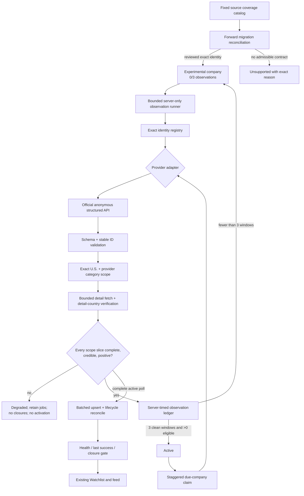

# Phase 03.8: Monitor and Poll the Branded Banking Companies Currently on Watchlist - Research

**Researched:** 2026-07-25
**Domain:** Exact-identity ATS connectors, scoped polling, staged activation, and safe lifecycle reconciliation
**Confidence:** MEDIUM

<user_constraints>
## User Constraints (from CONTEXT.md)

### Locked Decisions

### Frozen Company Roster and Portal Boundary
- **D-01:** Target exactly these ten currently unsupported catalog entries: Morgan Stanley, Goldman Sachs, JPMorgan Chase, Bank of America, Citi, BlackRock, Wells Fargo, UBS, Barclays, and Charles Schwab.
- **D-02:** Freeze that roster for Phase 03.8. Companies added later require separate scope and must not enter this phase implicitly.
- **D-03:** Capital One and Fidelity are already-active Workday sources and are excluded from the target roster. Preserve their existing identities and behavior with automated regression tests only; do not reactivate, re-onboard, or require an additional natural production poll for them.
- **D-04:** For each target, use the primary official company careers website as the authoritative entry point and monitor only the single stable public job-search contract behind that portal.
- **D-05:** Do not enumerate or combine secondary, regional, business-unit, campus, or specialist portals. If the primary portal lacks a stable pollable contract, retain an Unsupported disposition instead of widening discovery.

### Provider and Contract Boundary
- **D-06:** Build reusable provider-family adapters when several target companies share a provider, but authorize polling only through exact, reviewed, server-owned company identities.
- **D-07:** Never expose an unrestricted generic provider adapter that accepts caller-controlled hosts, paths, tenant IDs, site IDs, facets, or credentials.
- **D-08:** Accept only anonymously accessible structured machine contracts such as JSON, XML, public APIs, or feeds. HTML parsing, authenticated endpoints, headless-browser polling, challenge handling, WAF bypasses, and logged-in scraping are prohibited.
- **D-09:** An undocumented anonymous structured endpoint is acceptable only when live evidence proves exact identity, stable job IDs, complete pagination, usable detail content, credible completeness, bounded behavior, and fail-closed error handling.
- **D-10:** Prioritize provider families that cover multiple target companies before one-off branded contracts. Rollout order may follow the evidence discovered during research, but it must not change the frozen roster or evidence standard.

### U.S. and Category Scope
- **D-11:** Ingest United States jobs only. Apply exact provider country facets when available and verify country from job-detail evidence before materializing a posting.
- **D-12:** Across all ten targets, a posting is eligible only when a trustworthy provider-supplied category or job-family label contains at least one of these terms: Data, Technology, Finance, Investment, Research, Risk, or Capital Markets.
- **D-13:** Match those terms case-insensitively as normalized whole words or whole phrases. `Data & Analytics` matches Data, `Capital Markets Technology` matches Capital Markets and Technology, and `Database Administration` does not match Data.
- **D-14:** Do not use substring matching, title fallback, description inference, or downstream broad ingestion to compensate for missing category evidence.
- **D-15:** If a provider does not expose a trustworthy category/job-family field, fail closed. Keep the company Unsupported or Degraded with a category-evidence reason rather than ingesting unscoped jobs.
- **D-16:** Polling must remain operationally bounded even when the complete U.S. provider population is large. Use bounded page/detail concurrency, per-run time budgets, batched persistence, and staggered company scheduling. Any exceeded bound or incomplete observation becomes Degraded, retains last-known jobs, and authorizes no closures.

### Watchlist Onboarding and Lifecycle
- **D-17:** Once a frozen catalog entry has a reviewed connector identity, automatically reconcile it into an exact Experimental company record through a forward-only, migration-controlled path. Initial onboarding must not require the user to remove or re-enter the URL.
- **D-18:** Roll out one provider family at a time. Companies within and across waves retain independent observation, activation, scheduling, health, and failure state; one failure must not authorize or block another company.
- **D-19:** Show a newly admitted source immediately through the existing Watchlist Experimental presentation, including `0–3 checks passed` progress and scheduled polling off.
- **D-20:** Preserve the existing activation contract: three clean server-timed observations are required before Active scheduled polling begins.
- **D-21:** Preserve existing removal behavior. Removing an operational company stops monitoring and leaves its catalog entry visible as Disabled/Not monitored. Re-adding requires fresh verification of the exact primary URL.

### Completion and Acceptance
- **D-22:** Completion is truthful best effort across all ten targets, not an activation quota. Every company must have either a proven monitored identity or a current Unsupported disposition with specific evidence and reason.
- **D-23:** A source cannot activate on a zero-result proof. At least one eligible U.S. posting in an allowed provider category must prove category mapping, details, normalization, and ingestion end to end.
- **D-24:** Every newly Active company must complete at least one natural scheduled production poll on the final exact release. The poll must finish healthy, produce credible U.S./category-scoped evidence, and demonstrate that incomplete or failed observations cannot close jobs.
- **D-25:** Final signed-in UAT verifies Watchlist state and observation/health presentation, then inspects at least one correctly filtered job from each newly activated provider family.
- **D-26:** Existing last-known-job retention, safe close/reopen behavior, heartbeat health, exact-source authorization, and independent failure isolation remain mandatory for all new connectors.

### the agent's Discretion
- Choose provider-family implementation order after research identifies which primary portals share reusable structured contracts.
- Choose adapter module boundaries, exact server-owned identity fields, migration names, verification fixtures, and evidence tooling.
- Choose bounded concurrency, invocation budgets, database batch sizes, and staggered claim scheduling that meet the safety decisions above without weakening the 5–15 minute discovery target.
- Choose the normalized Unicode/case-folding implementation for whole-word/phrase category matching, provided the examples and fail-closed behavior in D-13 through D-15 remain exact.

### Folded Todos
- **Pilot Workday polling for 10 companies** (`.planning/todos/pending/2026-07-20-pilot-workday-polling-for-10-companies.md`): fold its reliability contract into Phase 03.8—exact server-owned identities, independent scheduling and health, truthful completeness, safe closure, degraded-source behavior, and regression isolation. Its historical candidate roster is not adopted; D-01 is the authoritative Phase 03.8 roster, and Capital One/Fidelity remain regression-only.

### Deferred Ideas (OUT OF SCOPE)
- Secondary, regional, campus, business-unit, and specialist career portals are deferred to later phases.
- Companies added to the Watchlist after the D-01 roster freeze are deferred to later phases.
- HTML parsing, headless-browser polling, authenticated provider APIs, and access-control bypasses are rejected rather than deferred.

### Reviewed Todos (not folded)
- **Refine company visibility controls** — unrelated UI refinement; Phase 03.8 reuses the existing Watchlist presentation.
- **Consolidate score tier controls** — unrelated Dashboard preference work.
- **Replace experience cap with title exclusions** — already handled by prior dashboard/filter work and outside connector scope.
- **Add SuccessFactors and Paylocity connectors** — Paylocity work was completed in Phase 03.1; Phase 03.8 is limited to the frozen ten-company primary-portal evidence.
</user_constraints>

<phase_requirements>
## Phase Requirements

| ID | Description | Research Support |
|----|-------------|------------------|
| DISC-01 | System polls watchlist ATS endpoints on a schedule that keeps discovery-to-feed within 5–15 minutes. | Pin a ten-minute per-source cadence, one-minute claim cron, maximum four-minute initial stagger, and 120-second stop-scheduling reserve; statically test the resulting 13-minute steady-state ceiling and prove hosted due/claim/completion/feed timestamps stay within 15 minutes. [VERIFIED: `.planning/REQUIREMENTS.md`; resolved operational-bounds contract below] |
| DISC-07 | System validates one representative company per feasible additional source platform while preserving existing provider support. | Morgan Stanley proves an Eightfold candidate, JPMorgan Chase proves an Oracle Recruiting candidate, and the phase must preserve all current registry entries plus Capital One/Fidelity Workday identities. [VERIFIED: live official portal probes; `supabase/functions/_shared/connectors.ts`] |
| DISC-08 | System validates the agreed finance-company set by direct stable monitoring or records canonical link, provider evidence, explicit `unsupported_with_reason`, and never labels it monitored. | The portal evidence matrix gives a current disposition path for all ten frozen companies and identifies seven that presently fail the admissible-contract boundary. [VERIFIED: live official portal probes; `supabase/migrations/0013_source_coverage_catalog.sql`] |
| DISC-09 | Failed, blocked, changed, or implausibly empty sources retain last-known jobs, report Degraded, and never close jobs; new connectors are staged before scheduled activation. | Keep the existing `PollObservation`/lifecycle closure gate, fix the zero-result activation gap, and add an Experimental observation runner because the active poller cannot currently observe migration-admitted Experimental sources. [VERIFIED: `supabase/functions/_shared/lifecycle.ts`; `supabase/functions/poll-tick/index.ts`; `supabase/migrations/0037_us_workday_dashboard_queue.sql`] |
</phase_requirements>

## Summary

Three primary portals currently justify connector implementation work: Morgan Stanley delegates from its official careers site to an anonymous Eightfold JSON search/detail contract; JPMorgan Chase exposes anonymous Oracle Recruiting Candidate Experience list/detail JSON; Goldman Sachs exposes an anonymous branded GraphQL list/detail contract. Live probes returned stable identifiers, usable detail content, provider category fields, and explicit pagination mechanics. These are connector **candidates**, not pre-approved activations: each must still pass full-page reconciliation, exact U.S. detail verification, the shared whole-word category predicate, a non-zero eligible end-to-end proof, three clean observation windows, and a natural scheduled production poll. [VERIFIED: live official portal probes] [CITED: https://www.morganstanley.com/careers/career-opportunities-search/] [CITED: https://jpmc.fa.oraclecloud.com/hcmUI/CandidateExperience/en/sites/CX_1001/requisitions] [CITED: https://higher.gs.com/roles]

The other seven should remain `unsupported_with_reason` on current evidence. Bank of America's primary search is HTML; Citi, BlackRock, Barclays, and Charles Schwab use Radancy/TalentBrew responses whose JSON envelope contains HTML result fragments; Wells Fargo returned a managed challenge; UBS's JSON endpoint required an anonymous session and anti-forgery value bootstrapped from HTML. All are incompatible with the locked machine-only/no-challenge/no-HTML boundary. [VERIFIED: live official portal probes] [CITED: https://careers.bankofamerica.com/en-us/job-search] [CITED: https://jobs.citi.com/search-jobs] [CITED: https://careers.blackrock.com/search-jobs] [CITED: https://search.jobs.barclays/en/search-jobs] [CITED: https://www.schwabjobs.com/search-jobs] [CITED: https://www.wellsfargojobs.com/en/jobs/] [CITED: https://jobs.ubs.com/TGnewUI/]

The principal planning issue is lifecycle orchestration, not UI. Migration-controlled admission must atomically create an exact Experimental record only after current positive live proof and must atomically retain/return a failed candidate to Unsupported. The current scheduled claim selects Active companies only and `pollConnector` rejects non-Active companies; the current observation function also allows zero-count evidence for most providers and activates only a fixed provider set. The plan therefore needs a service-role exact-source terminal transition, a bounded server-only Experimental observation path, positive-only activation, and operational polling disabled until activation. [VERIFIED: `supabase/functions/poll-tick/index.ts`; `supabase/functions/_shared/connectors.ts`; `supabase/migrations/0037_us_workday_dashboard_queue.sql`]

**Primary recommendation:** Implement in isolated waves—shared scope/completeness primitives, Eightfold/Morgan Stanley, Oracle/JPMorgan Chase, then Goldman GraphQL—while updating all ten catalog dispositions and leaving every non-admissible portal Unsupported.

## Architectural Responsibility Map

| Capability | Primary Tier | Secondary Tier | Rationale |
|------------|--------------|----------------|-----------|
| Exact connector identity authorization | API / Backend | Database / Storage | The server-owned registry resolves a persisted exact `source_key`; callers never select network coordinates. [VERIFIED: `workday-identities.ts`; `provider-identities.ts`; `detect.ts`] |
| Anonymous provider fetching and schema validation | API / Backend | External provider boundary | Edge Functions own network requests, response validation, timeouts, pagination, detail concurrency, and error classification. [VERIFIED: `connectors.ts`; adapter modules] |
| U.S. and category eligibility | API / Backend | Database / Storage | Provider facets reduce the universe; adapter/detail evidence performs the authoritative fail-closed check before persistence. [VERIFIED: CONTEXT D-11 through D-15] |
| Scoped completeness and closure authorization | API / Backend | Database / Storage | The adapter emits observation evidence; lifecycle code and transactional persistence decide whether missing jobs may close. [VERIFIED: `adapters/types.ts`; `lifecycle.ts`; `poll-tick/index.ts`] |
| Experimental admission and activation | Database / Storage | API / Backend | Forward migrations reconcile catalog entries and enforce observation/activation rules; a service-role runner supplies server-timed evidence. [VERIFIED: migrations `0013`, `0015`, `0037`] |
| Scheduled independent polling | Database / Storage | API / Backend | Postgres claims due exact companies; `poll-tick` processes each result independently and records per-company health. [VERIFIED: `claim_due_companies`; `Promise.allSettled` in `poll-tick/index.ts`] |
| Watchlist status presentation | Browser / Client | Database / Storage | Existing code merges operational records with the fixed catalog and already renders Experimental, Active, Degraded, Disabled, and Unsupported. [VERIFIED: `web/src/lib/watchlist.ts`; `web/src/pages/Watchlist.tsx`] |

## Current Portal Evidence and Prescriptive Disposition

| Company | Primary portal / observed family | Current live evidence | Phase disposition |
|---------|----------------------------------|-----------------------|-------------------|
| Morgan Stanley | Official link delegates to Eightfold, exact host `morganstanley.eightfold.ai`, domain `morganstanley.com`. | Anonymous `/api/pcsx/search` returned `count`, stable IDs, locations, departments and business-area/country facets; `/api/pcsx/position_details` returned description and exact locations. [VERIFIED: live official portal probe] | **Implement Eightfold candidate first.** Admit only after full pagination, exact U.S. detail, allowed business-area mapping, and non-zero eligible proof pass. |
| Goldman Sachs | Branded Higher site; custom GraphQL gateway `api-higher.gs.com`. | Anonymous `roleSearch` returned `totalCount`, page number/size, stable `roleId`/source IDs, locations, division/job function; role detail returned description and apply data. [VERIFIED: live official portal probe] | **Implement branded GraphQL candidate last.** Fail activation unless a trustworthy allowed category field is positive and complete pagination reconciles. |
| JPMorgan Chase | Oracle Recruiting Candidate Experience, exact host and site `CX_1001`. | Anonymous REST returned `Offset`, `Limit`, `TotalJobsCount`, stable IDs, category/location facets and job family/function; detail REST returned description, category, and country. [VERIFIED: live official portal probe] [CITED: https://docs.oracle.com/en/cloud/saas/human-resources/farws/Recruiting__Recruiting_CE_Job_Requisition_Details.html] | **Implement Oracle candidate second.** Freeze host/site and reviewed facet IDs; query allowed category slices, dedupe, and verify detail country. |
| Bank of America | Branded primary search. | The current primary page exposes job listings as HTML; no admissible anonymous structured listing/detail contract was proven. [VERIFIED: live official portal probe] | **Keep Unsupported:** `primary_portal_html_only_no_structured_machine_contract`. |
| Citi | Radancy/TalentBrew primary portal. | `/search-jobs/results` is a JSON envelope whose `results`/`filters` values are HTML fragments, not job objects. [VERIFIED: live official portal and provider-script probe] | **Keep Unsupported:** `radancy_results_require_html_parsing`. |
| BlackRock | Radancy/TalentBrew, site id `62164`, organization id `45831`. | Primary search declares `/search-jobs/results`; shared provider code returns HTML fragments inside JSON. [VERIFIED: live official portal and provider-script probe] | **Keep Unsupported:** `radancy_results_require_html_parsing`. |
| Wells Fargo | Branded primary search. | A clean anonymous request received a Cloudflare managed challenge rather than a usable public machine contract. [VERIFIED: live official portal probe] | **Keep Unsupported:** `primary_portal_managed_challenge_no_bypass`. |
| UBS | IBM BrassRing/TGNewUI, partner `25008`, site `5012`. | JSON jobs include stable requisition IDs, descriptions, function categories, location fields and totals, but the successful request required an anonymous cookie and anti-forgery value extracted from HTML. [VERIFIED: live official portal probe] | **Keep Unsupported:** `structured_endpoint_requires_html_bootstrap_session`. Do not implement token extraction. |
| Barclays | Radancy/TalentBrew primary portal. | Shared result contract returns HTML fragments inside JSON. [VERIFIED: live official portal and provider-script probe] | **Keep Unsupported:** `radancy_results_require_html_parsing`. |
| Charles Schwab | Radancy/TalentBrew primary portal. | Shared result contract returns HTML fragments inside JSON. [VERIFIED: live official portal and provider-script probe] | **Keep Unsupported:** `radancy_results_require_html_parsing`. |

The matrix is dated evidence, not a permanent provider judgment. Execution may re-probe each exact primary portal once, but it must not switch portals or relax the contract boundary when evidence remains negative. [VERIFIED: CONTEXT D-04, D-05, D-08, D-22]

## Standard Stack

### Core

| Library / Facility | Version | Purpose | Why Standard |
|--------------------|---------|---------|--------------|
| Supabase Edge Functions / Deno TypeScript | Hosted runtime | Provider fetch, adapter normalization, observation, and polling | This is the existing backend boundary; no new runtime is needed. [VERIFIED: repository `supabase/functions`] [CITED: https://supabase.com/docs/guides/functions] |
| Built-in `fetch`, `AbortController`, `URL`, `crypto.subtle` | Runtime built-ins | HTTP, hard timeouts, exact URL construction, evidence digests | Avoids adding network/concurrency packages and matches current adapters. [VERIFIED: codebase grep] |
| `@supabase/supabase-js` | 2.110.7 | Service-role RPC, company/job persistence, health updates | Already pinned in the web package and Edge Function imports. [VERIFIED: `web/package.json`; Edge Function imports] |
| PostgreSQL functions and forward migrations | Existing Supabase Postgres | Exact admission, claim scheduling, observation ledger, activation guard | Existing lifecycle invariants live in database functions and grants. [VERIFIED: migrations `0013`, `0015`, `0037`] |

### Supporting

| Library / Facility | Version | Purpose | When to Use |
|--------------------|---------|---------|-------------|
| Vitest | 4.1.10 installed | Pure adapter, scope matcher, registry, lifecycle and migration regressions | Use existing `web/tests` infrastructure for all deterministic contracts. [VERIFIED: `web/package-lock.json`; local binary probe] |
| Supabase CLI | 2.109.1 pinned | Local function/database verification and deployment checks | Invoke from `web/node_modules/.bin/supabase`; the global command is not installed. [VERIFIED: `web/package.json`; environment probe] |
| `pg_cron` + `pg_net` + Vault | Hosted project facilities | Periodic Edge Function invocation with server-held token | Reuse the project's scheduling pattern; do not add a third-party scheduler. [CITED: https://supabase.com/docs/guides/functions/schedule-functions] |

### Alternatives Considered

| Instead of | Could Use | Tradeoff |
|------------|-----------|----------|
| Built-in bounded async worker pool | A concurrency package | Adds supply-chain and runtime surface for a small primitive; do not add it. |
| Existing normalized adapter contract | Provider-specific persistence paths | Duplicates lifecycle, health, dedupe, and safe-closure semantics; reject. |
| Explicit Unsupported evidence | HTML/headless/authenticated scraping | Contradicts locked D-08 and increases operational/security risk; reject. |

**Installation:** No external packages are required. Preserve the current lockfile and imports. [VERIFIED: repository dependency audit]

## Package Legitimacy Audit

No external package installation is recommended for this phase, so the Package Legitimacy Gate is not applicable. Existing pinned dependencies remain unchanged. [VERIFIED: Standard Stack recommendation]

## Architecture Patterns

### System Architecture Diagram



The critical decision branches are contract admissibility, scoped completeness, and activation—not whether an HTTP response merely succeeded. [VERIFIED: CONTEXT D-08, D-09, D-16, D-20, D-23]

### Recommended Project Structure

```text
supabase/
├── functions/
│   ├── _shared/
│   │   ├── adapters/
│   │   │   ├── eightfold.ts             # Morgan list/detail + slice completeness
│   │   │   ├── oracle-recruiting.ts      # JPMC ORC list/detail + facet slices
│   │   │   ├── goldman-higher.ts         # Branded GraphQL list/detail
│   │   │   ├── scope.ts                  # Unicode category and U.S. predicates
│   │   │   └── types.ts                  # Normalized observation/evidence contract
│   │   ├── branded-identities.ts         # frozen discriminated exact identities
│   │   ├── connectors.ts                 # registry wiring only
│   │   └── detect.ts                     # exact primary URL recognition/authorization
│   ├── observe-connectors/
│   │   └── index.ts                      # bounded Experimental evidence runner
│   └── poll-tick/
│       └── index.ts                      # bounded Active polling and persistence
└── migrations/
    └── 00xx_phase_03_8_*.sql             # forward-only catalog/admission/activation/claim rules

web/
├── tests/
│   ├── branded-identities.test.ts
│   ├── branded-adapters.test.ts
│   ├── branded-scope.test.ts
│   ├── phase-03-8-activation.test.ts
│   └── phase-03-8-migration.test.ts
└── src/lib/watchlist.test.ts              # ten dispositions + Capital One/Fidelity regressions
```

Keep identity, provider transport, eligibility, and lifecycle evidence separate. This makes it impossible for a recognized provider URL to become network authority without exact registry resolution. [VERIFIED: existing `detect.ts` + identity registry pattern]

### Pattern 1: Discriminated Exact Identity Registry

**What:** Store every network-affecting field in immutable server code and persist only its canonical `source_key`; resolve by exact provider-specific tuple before any fetch. [VERIFIED: `workday-identities.ts`; `provider-identities.ts`]

**When to use:** Detection, migration reconciliation, Experimental observation, Active polling, and re-add verification.

```typescript
type BrandedIdentity =
  | {
      provider: "eightfold";
      sourceKey: "eightfold:morganstanley";
      host: "morganstanley.eightfold.ai";
      domain: "morganstanley.com";
      countryValue: "United States of America";
    }
  | {
      provider: "oracle_recruiting";
      sourceKey: "oracle:jpmc:CX_1001";
      host: "jpmc.fa.oraclecloud.com";
      siteNumber: "CX_1001";
      countryFacetId: "300000000289738";
      allowedCategoryFacetIds: readonly string[];
    }
  | {
      provider: "goldman_higher";
      sourceKey: "goldman_higher:roles";
      host: "api-higher.gs.com";
      graphqlPath: "/gateway/api/v1/graphql";
    };

function resolveIdentity(sourceKey: string): BrandedIdentity {
  const identity = BRANDED_IDENTITIES.find((item) => item.sourceKey === sourceKey);
  if (!identity) throw new ConnectorError("unsupported_identity");
  return identity;
}
```

Source: established repository authorization pattern, adapted to the three proven candidates. [VERIFIED: `supabase/functions/_shared/workday-identities.ts`]

### Pattern 2: Slice-Level Completeness Before Union

**What:** When provider filters require several allowed categories, paginate and reconcile every fixed category slice independently, then deduplicate stable IDs. The union is credible only if every slice reports complete pagination and every retained job has exact U.S./category evidence. [VERIFIED: live JPMC facet contract; CONTEXT D-09, D-11 through D-16]

**When to use:** Oracle category-facet unions and any provider whose server-side category filter is one-valued.

```typescript
type SliceEvidence = {
  scopeKey: string;
  expected: number;
  fetched: number;
  pages: number;
  complete: boolean;
};

const complete =
  slices.length > 0 &&
  slices.every((slice) =>
    slice.complete &&
    slice.expected === slice.fetched &&
    slice.pages <= identity.maxPages
  );

return {
  jobs: dedupeByStableId(eligibleJobs),
  completeness: complete ? "complete" : "partial",
  credibleForClosure: complete && warnings.length === 0,
  allowMissingClosure: complete,
  warnings,
};
```

Overlapping category slices make the sum of provider totals unsuitable as the union's expected count; retain per-slice evidence and compare the final unique cardinality separately. [VERIFIED: relational consequence of multi-category union]

### Pattern 3: Two-Lane Experimental and Active Execution

**What:** Experimental companies use a service-role-only observation runner that never persists production jobs or closes rows; Active companies use the existing polling/lifecycle path. Both call the same exact registry and adapter. [VERIFIED: current Active-only claim and `pollConnector` guard expose the lane gap]

**When to use:** Automatic migration admission and all three pre-activation windows.

The observation runner must claim each Experimental source independently, enforce its observation window in SQL, and record evidence only after a full positive scoped result. It must not reuse a user-supplied URL or activate directly. [VERIFIED: CONTEXT D-17 through D-20, D-23]

### Pattern 4: Deadline-Aware Bounded Work Pool

**What:** Bound company, page, and detail concurrency separately; check a monotonic deadline before scheduling more work; abort outstanding fetches when the reserve is reached; emit a partial observation. [CITED: https://supabase.com/docs/guides/functions/limits]

**When to use:** Every connector and both runners.

Recommended initial limits are configuration constants, not identity inputs: company concurrency 2, page concurrency 2, detail concurrency 4, page cap 100, and an invocation stop-scheduling deadline of 120 seconds. These values are conservative starting points and require fixture/live timing verification before being locked. [ASSUMED]

Supabase currently documents 256 MB memory, 150 seconds maximum duration on Free, 400 seconds on paid plans, 2 seconds CPU per request, and a 150-second request idle timeout. The phase should design to the Free-plan wall-clock boundary because the project requires near-zero cost. [CITED: https://supabase.com/docs/guides/functions/limits]

### Pattern 5: Unicode Whole-Word / Whole-Phrase Scope Predicate

**What:** Normalize provider labels with NFKC, collapse whitespace, case-fold, and test escaped allowed phrases against Unicode letter/number boundaries—not JavaScript `\b` and never raw substring matching. [VERIFIED: CONTEXT D-12 through D-15]

```typescript
const ALLOWED = [
  "data", "technology", "finance", "investment",
  "research", "risk", "capital markets",
] as const;

function normalizeLabel(value: string): string {
  return value.normalize("NFKC").toLocaleLowerCase("en-US")
    .replace(/\s+/gu, " ").trim();
}

function containsWholeTerm(label: string, term: string): boolean {
  const escaped = term.replace(/[.*+?^${}()|[\]\\]/g, "\\$&");
  return new RegExp(
    `(?:^|[^\\p{L}\\p{N}])${escaped}(?:$|[^\\p{L}\\p{N}])`,
    "u",
  ).test(label);
}
```

Source: phase-locked semantics; implementation must be verified with positive, punctuation, Unicode-adjacency, and `Database Administration` negative tests. [VERIFIED: CONTEXT D-13]

### Anti-Patterns to Avoid

- **“JSON content type means structured jobs”:** Radancy returns JSON whose useful fields are HTML fragments; classify the payload fields, not just the envelope. [VERIFIED: live provider probe]
- **Automatic activation from migration:** Admission creates Experimental state only; observations, not seed data, earn activation. [VERIFIED: CONTEXT D-17 through D-20]
- **Using the Active poller to observe Experimental sources:** Current guards reject this; create an explicit observation lane rather than weakening the Active authorization check. [VERIFIED: `connectors.ts`; `poll-tick/index.ts`]
- **One global completeness number for a category union:** Track each fixed slice; otherwise a truncated slice can hide behind the union count. [VERIFIED: completeness reasoning]
- **`Promise.allSettled` over every claimed company without an inner limit:** Failure isolation does not bound concurrency. Wrap company and detail work in explicit pools. [VERIFIED: `poll-tick/index.ts`]
- **Title/description category inference:** It violates the locked scope and can make closure universes unstable. [VERIFIED: CONTEXT D-14]
- **Editing deployed migrations:** Add forward-only migrations that replace functions and reconcile rows idempotently. [VERIFIED: project migration convention]

## Don't Hand-Roll

| Problem | Don't Build | Use Instead | Why |
|---------|-------------|-------------|-----|
| Provider authorization | Generic URL proxy or caller-defined connector | Frozen discriminated identity registry | Prevents SSRF, tenant confusion, and identity drift. [VERIFIED: existing registry pattern] |
| Lifecycle closure | Provider-specific close SQL | Existing normalized observation + `lifecycle.ts` reconciliation | Already handles grace, reopen, missing-closure gates, and failure retention. [VERIFIED: `lifecycle.ts`] |
| Activation counter | In-memory retries or client timestamps | Service-role observation ledger and SQL window uniqueness | Server time, row locking, replay protection, and three-window cap already exist. [VERIFIED: migration `0037`] |
| Scheduling | New external scheduler | Existing Supabase `pg_cron`/`pg_net` invocation and due-company claim | Keeps cost and operations within the current platform. [CITED: https://supabase.com/docs/guides/functions/schedule-functions] |
| HTML extraction / challenge handling | Parser, browser, cookie harvester, WAF workaround | Explicit Unsupported evidence | Locked phase boundary rejects these methods. [VERIFIED: CONTEXT D-08] |
| Concurrency control | Unbounded `Promise.all` trees | Small shared worker-pool helper + `AbortController` deadlines | Bounds memory, rate, and wall-clock use without a dependency. |
| Category classification | Title NLP, description search, substring match | Shared exact provider-label predicate | Preserves a deterministic scoped universe and locked examples. [VERIFIED: CONTEXT D-12 through D-15] |

**Key insight:** The deceptively hard problem is proving that an observation represents the entire eligible U.S. universe; transport success alone must never authorize closure or activation.

## Common Pitfalls

### Pitfall 1: Migration Admission Has No Observation Path

**What goes wrong:** Exact companies appear Experimental at `0/3` forever, or implementers weaken the Active poll guard to make observations run.

**Why it happens:** `claim_due_companies` selects Active rows and `pollConnector` requires Active, while D-17 removes the manual URL-verification step. [VERIFIED: `0037_us_workday_dashboard_queue.sql`; `connectors.ts`]

**How to avoid:** Plan a service-role-only `observe-connectors` lane with independent SQL claim/window enforcement and the same registry/adapters.

**Warning signs:** Experimental rows never gain checks; scheduler flags become true before activation; a public endpoint accepts `source_key`.

### Pitfall 2: Zero-Result Evidence Activates a New Provider

**What goes wrong:** Three empty “complete” responses satisfy the database progress counter.

**Why it happens:** The current observation function rejects non-positive evidence only for Paylocity and accepts `p_job_count = 0` for other allowed providers. [VERIFIED: migration `0037`, `record_connector_observation`]

**How to avoid:** A forward migration must require `job_count > 0` for every Phase 03.8 provider and activate only an explicit exact release allowlist after three positive clean windows.

**Warning signs:** `0` eligible jobs increments progress; activation tests omit D-23; provider enum expansion alone enables activation.

### Pitfall 3: Filtered Pagination Appears Complete but Is Not

**What goes wrong:** One category slice truncates, changes total mid-run, or overlaps another slice; missing jobs are then closed.

**Why it happens:** A global count cannot prove every slice, and concurrent provider updates can move totals.

**How to avoid:** Record first/last totals, pages, fetched IDs, duplicates, and completion for each immutable filter slice. Any drift, cap, malformed page, repeated page, or missing detail sets `completeness = partial` and `allowMissingClosure = false`.

**Warning signs:** page cap reached exactly; repeated IDs/pages; `expectedCount` is the sum of category totals; provider total changes during a run.

### Pitfall 4: Provider Category Semantics Drift

**What goes wrong:** A display label moves, disappears, or stops matching the reviewed category ID; jobs silently broaden or vanish.

**Why it happens:** Exact facet IDs and their human labels are external runtime state.

**How to avoid:** Freeze both ID and expected normalized label where IDs exist, validate the live label every run, and degrade on mismatch. For Goldman/Eightfold label-based fields, validate the field's presence and provider-defined provenance before use.

**Warning signs:** known category ID returns a different label; category field is empty; developers fall back to title or description.

### Pitfall 5: U.S. List Filter Without Detail Verification

**What goes wrong:** Multi-location or remote jobs outside the United States enter the feed.

**Why it happens:** List facets can be broad and location strings can be ambiguous.

**How to avoid:** Use the exact country filter to reduce traffic, then require detail evidence that the posting has at least one United States location and materialize only the U.S.-scoped posting representation.

**Warning signs:** location contains only a city; global/remote labels pass; detail country is absent.

### Pitfall 6: Unsupported Rows Accidentally Look Monitored

**What goes wrong:** A catalog careers link or provider label is interpreted as an active connector.

**Why it happens:** The fixed catalog and operational company rows are merged in the client.

**How to avoid:** Only operational Active rows with scheduled polling may present as monitored; Unsupported rows keep precise `unsupported_with_reason` evidence. Preserve the existing merge key and test all ten outcomes. [VERIFIED: `web/src/lib/watchlist.ts`]

**Warning signs:** Radancy/UBS rows display Experimental without an admissible identity; catalog seed sets `monitored=true`.

### Pitfall 7: Rate/Runtime Bounds Are Declared but Not Enforced

**What goes wrong:** A ten-company claim spawns all companies, pages, and details concurrently and the function ends mid-observation.

**Why it happens:** Current top-level `Promise.allSettled` isolates failures but does not cap simultaneous upstream calls. [VERIFIED: `poll-tick/index.ts`]

**How to avoid:** Claim fewer companies, stagger provider next-due timestamps, use nested bounded pools, and stop scheduling before the invocation reserve.

**Warning signs:** a timeout occurs after writes begin; no explicit page/detail concurrency test; one company consumes the entire run.

### Pitfall 8: Provider Schema Changes Become “Empty Success”

**What goes wrong:** Missing list fields normalize to an empty array that is considered complete and closes jobs.

**Why it happens:** Permissive optional chaining hides contract drift.

**How to avoid:** Validate required object shapes and stable ID/category/location/detail fields. Schema failure is `provider_contract_changed`, Degraded, and never closure-credible.

**Warning signs:** count remains positive but parsed job count becomes zero; warnings are logged without flipping completeness.

## Code Examples

### Exact Oracle List Query Construction

```typescript
function oracleListUrl(identity: OracleIdentity, slice: OracleSlice, offset: number) {
  const url = new URL(
    `https://${identity.host}/hcmRestApi/resources/latest/recruitingCEJobRequisitions`,
  );
  url.searchParams.set("onlyData", "true");
  url.searchParams.set("finder", [
    "findReqs",
    `siteNumber=${identity.siteNumber}`,
    `limit=${identity.pageSize}`,
    `offset=${offset}`,
    `selectedLocationsFacet=${identity.countryFacetId}`,
    `selectedCategoriesFacet=${slice.categoryFacetId}`,
  ].join(";"));
  return url;
}
```

The exact finder syntax and response fields must be captured in fixtures from the reviewed official site; callers receive no host, site, or facet parameters. [VERIFIED: live official JPMorgan Chase probe] [CITED: https://docs.oracle.com/en/cloud/saas/human-resources/farws/op-recruitingicejobrequisitions-get.html]

### Fail-Closed Observation

```typescript
function degradedObservation(
  code: string,
  warnings: string[],
): PollObservation {
  return {
    jobs: [],
    completeness: "partial",
    credibleForClosure: false,
    allowMissingClosure: false,
    expectedCount: null,
    pageCount: 0,
    warnings: [code, ...warnings],
  };
}
```

Use the repository's exact `PollObservation` field types when implementing; this example shows the invariant, not a replacement type definition. [VERIFIED: `supabase/functions/_shared/adapters/types.ts`]

### Proof-Gated Exact-Source Terminal Reconciliation

```sql
-- Forward migration sketch: install a service-role-only function over literal tuples.
-- admit_experimental requires a current positive live evidence digest and atomically
-- sets catalog Experimental plus company Experimental 0/3/off.
-- unsupported requires a bounded precise reason and atomically sets catalog
-- unsupported_with_reason while removing non-Active operational authority.
select * from public.finalize_branded_connector_candidate(
  'eightfold:morganstanley',
  'admit_experimental',
  null,
  'sha256:...'
);
```

The final migration must follow actual table/constraint names, must not pre-admit from
fixtures, must not resurrect Disabled or overwrite Active, and must update catalog plus
operational authority atomically. The negative branch is mandatory so a failed proof
cannot remain indefinitely Experimental or Degraded. [VERIFIED: CONTEXT D-17, D-21,
D-22; existing migration patterns]

## Prescriptive Provider Waves

1. **Foundation wave:** add the shared exact identity union, Unicode scope predicate, slice-evidence model, bounded pool/deadline helper, migration activation rules, and Experimental observation lane. Do not add a provider before these gates exist.
2. **Eightfold wave:** implement Morgan Stanley only, prove all pages and detail scope, run three positive clean windows, then activate and observe a natural scheduled poll.
3. **Oracle Recruiting wave:** implement JPMorgan Chase only, freeze reviewed site/location/category facet IDs, prove every category slice and dedupe, then follow the same release gate.
4. **Goldman Higher wave:** implement the branded GraphQL contract only after a positive trustworthy provider-category mapping is proven; keep Unsupported if the category field cannot satisfy D-12 through D-15.
5. **Disposition wave:** update Bank of America, Citi, BlackRock, Wells Fargo, UBS, Barclays, and Charles Schwab with current precise Unsupported reason/evidence. Re-probe only their exact primary portals; do not implement prohibited workarounds.
6. **Cross-provider release wave:** run Capital One/Fidelity regression tests, failure-isolation tests, signed-in Watchlist UAT, and one natural final-release poll per newly Active provider family.

This order favors the strongest admissible contract first while ensuring the reusable safety foundation precedes any activation. [VERIFIED: live evidence and existing architecture]

## Verification Strategy

Although `.planning/config.json` explicitly disables the formal Nyquist Validation Architecture section, planning still needs executable verification tasks. [VERIFIED: `.planning/config.json`]

| Contract | Required automated evidence |
|----------|-----------------------------|
| Frozen identity | Unknown source keys, altered host/site/domain/facet/path, redirect drift, and caller-supplied network fields fail before `fetch`. |
| Category matcher | All seven terms; case, whitespace, punctuation and Unicode boundaries; `Data & Analytics` positive; `Capital Markets Technology` positive; `Database Administration` negative. |
| Adapter pagination | Multi-page fixture; repeated page; count drift; malformed shape; page cap; timeout; duplicate stable ID; missing category; missing detail country. |
| Completeness/closure | Every incomplete/failure/empty case produces Degraded, retains rows, and sets `allowMissingClosure=false`; only a complete scoped universe may close. |
| Activation | Zero jobs never increments; duplicate/same-window observation never increments; exactly three distinct server windows activate only a release-allowlisted exact source. |
| Migration | All ten catalog rows receive expected initial disposition; hosted positive/negative terminal transitions are exact and idempotent; Disabled stays Disabled; Active cannot be overwritten; no duplicate company; rollback is not assumed. |
| Regression | Capital One and Fidelity source keys, Active behavior, claim eligibility, polling, and Watchlist state remain unchanged. |
| Isolation | One provider timeout/schema error does not block another company's observation, claim, health, or persistence. |
| Natural poll gate | Release evidence records activation/due/claim/completion/feed timestamps within 15 minutes, complete positive scope with persisted job provenance, healthy state, and a forced incomplete observation that cannot close jobs followed by Active recovery. |

Use fixtures for deterministic CI and separate live-contract probes as explicit release evidence; live third-party availability must not make the unit suite flaky. [VERIFIED: existing `web/tests` pattern]

## State of the Art

| Old / Existing Approach | Required Current Approach | Impact |
|-------------------------|---------------------------|--------|
| Manual `verify-board` URL admission for a user-added company | Migration-owned service-role exact-source transition admits current positive live proof or records terminal Unsupported | Meets D-17/D-22 without a generic admin URL surface or pre-admission from fixtures. [VERIFIED: current flow + CONTEXT] |
| Observation activation provider set hard-coded to current families | Explicit Phase 03.8 provider/source release allowlist with positive evidence rule | New providers cannot activate merely because an enum exists. [VERIFIED: migration `0037`] |
| Active-only claim plus unbounded top-level company concurrency | Separate bounded Experimental/Active lanes and provider-aware staggering | Prevents stuck onboarding and invocation exhaustion. [VERIFIED: current code + official limits] |
| Provider total + normalized jobs | Per-filter-slice completeness, detail scope evidence, and deduped union | Makes closure proof truthful for category-filtered populations. |
| Historical catalog provider labels | Current primary-portal evidence and precise Unsupported reason | UBS is now observed as BrassRing rather than the historical provider label; current evidence governs disposition. [VERIFIED: migration `0013`; live official portal] |

**Deprecated/outdated:**

- Treating every JSON response as a machine contract is invalid for Radancy's HTML-fragment envelope. [VERIFIED: live provider probe]
- The historical UBS provider description in the seed catalog is not sufficient current evidence; the primary portal currently presents BrassRing/TGNewUI. [VERIFIED: live official portal probe]
- The existing general observation function's zero-count behavior is insufficient for D-23 and must be replaced forward, not edited in place. [VERIFIED: migration `0037`]

## Project Constraints

No `AGENTS.md` exists in the repository. The applicable project instructions come from `.claude/CLAUDE.md` and `.planning/PROJECT.md`: use Cloudflare Pages + Supabase, preserve near-zero operating cost, keep the product feed-only, prioritize major employers, prohibit unsafe scraping/automation, use forward migrations, and do not log secrets or sensitive resume content. [VERIFIED: repository instruction files]

Research found no project-local `SKILL.md` files or populated `rules/*.md`; no additional project skill convention applies. [VERIFIED: project skill discovery scan]

## Environment Availability

| Dependency | Required By | Available | Version | Fallback |
|------------|-------------|-----------|---------|----------|
| Node.js | Vitest and repository tooling | ✓ | 26.3.1 | — |
| npm | Existing web dependencies/scripts | ✓ | 11.16.0 | — |
| Vitest | Automated contract tests | ✓ | 4.1.10 | — |
| TypeScript compiler | Static checks | ✓ | 6.0.2 | — |
| Supabase CLI | Local Edge/database checks | ✓, project-local | 2.109.1 pinned; version probe attempted a sandbox-forbidden telemetry write | Invoke `web/node_modules/.bin/supabase`; allow its normal config write in execution. |
| Standalone Deno | Direct Edge unit execution | ✗ | — | Use Supabase CLI runtime and Vitest pure-module tests. |
| Docker CLI / daemon | Local Supabase stack | CLI ✓; daemon not confirmed | CLI 29.6.2 | Use hosted dev project if local daemon is unavailable. |
| `curl` | Live release probes | ✓ | 8.7.1 | built-in `fetch` probe script |
| `jq` | Evidence inspection | ✓ | 1.6 | TypeScript JSON validation |

**Missing dependencies with no fallback:** None identified.

**Missing dependencies with fallback:** Standalone Deno is absent; use the pinned Supabase CLI/runtime. Docker daemon availability was not proven; hosted verification remains viable. [VERIFIED: environment probes]

## Security Domain

### Applicable ASVS Categories

| ASVS Category | Applies | Standard Control |
|---------------|---------|-----------------|
| V2 Authentication | Yes, administrative verification/UAT only | Preserve authenticated `verify-board` and signed-in Watchlist boundaries; the new scheduled observation endpoint is service-role/cron-only. [VERIFIED: current function auth] |
| V3 Session Management | No new user session mechanism | Reuse Supabase Auth; provider polling accepts no provider login/session. [VERIFIED: CONTEXT D-08] |
| V4 Access Control | Yes | Exact server-owned identity registry, service-role RPC grants, explicit provider/source activation allowlist, RLS-preserving migrations. |
| V5 Input Validation | Yes | Required-shape validation, exact enums/IDs, Unicode category predicate, numeric bounds, redirect/host checks, and fail-closed parsing. |
| V6 Cryptography | Evidence digest only | Reuse `crypto.subtle`/existing digest helper; never implement cryptography. [VERIFIED: codebase pattern] |

### Known Threat Patterns for the Stack

| Pattern | STRIDE | Standard Mitigation |
|---------|--------|---------------------|
| SSRF through host/path/site/facet input | Spoofing / Information Disclosure | Network coordinates exist only in frozen identity objects; no request body or DB free text becomes a URL. |
| Cross-company / cross-tenant confused deputy | Spoofing / Elevation of Privilege | Exact `source_key` resolves to one provider tuple and company; mismatch fails before fetch. |
| Redirect to an unreviewed host | Spoofing | Use `redirect: "error"` or verify every redirect target against the exact host allowlist. |
| Provider contract drift parsed as empty | Tampering | Required schema validation; contract errors are partial/Degraded and closure-ineligible. |
| Incomplete page union closes valid jobs | Tampering / Denial of Service | Per-slice reconciliation, stable-ID dedupe, deadline/page caps, and `allowMissingClosure=false` on any anomaly. |
| Upstream HTML/script content injection | Tampering / XSS | Reject non-JSON/XML list contracts; descriptions remain untrusted data and existing client sanitization continues. [VERIFIED: DOMPurify dependency / feed rendering pattern] |
| Resource/rate exhaustion | Denial of Service | Bounded nested pools, request timeouts, staggered claims, page/detail caps, batch persistence, invocation reserve. |
| Observation replay or fabricated time | Tampering | Service-role-only RPC, server `now()`, unique observation ID/window, row lock. [VERIFIED: migration `0037`] |
| Unauthorized activation by enum expansion | Elevation of Privilege | Separate exact release allowlist, positive count, three clean windows, and provider/source checks in SQL. |
| Secret disclosure in cron/logs | Information Disclosure | Store function token in Vault and log bounded error codes rather than credentials or full payloads. [CITED: https://supabase.com/docs/guides/functions/schedule-functions] |

## Assumptions Log

| # | Claim | Section | Risk if Wrong |
|---|-------|---------|---------------|
| A1 | Provider transport bounds of 2 companies, 2 pages, 4 details, and 100 pages are safe initial caps; the 120-second stop-scheduling reserve is locked by the resolved DISC-01 contract. | Pattern 4 | Lower transport caps may require a precise Unsupported result for a provider population that cannot complete; caps must never be raised so the 15-minute latency or runtime boundary can be exceeded. |

All portal classifications, current code gaps, official runtime limits, and repository constraints were verified in this session. Provider page/detail concurrency caps remain conservative implementation assumptions; admission, terminal disposition, durable evidence, cadence, stagger, cron, reserve, and hosted latency assertions are resolved contracts.

## Open Questions (RESOLVED)

1. **RESOLVED — Goldman Sachs category admissibility is decided only by current live proof, never by fixtures or inference.**
   - List/detail JSON exposes `jobFunction` and `division`, but observed values can be empty or lack an allowed exact term. [VERIFIED: live official portal probe]
   - Per D-12 through D-15 and D-23, migration 0040 installs an exact-source, service-role-only terminal transition. A current non-zero complete U.S. role whose trustworthy provider field matches the shared whole-word/phrase predicate may atomically admit `goldman_higher:roles` to Experimental `0/3`; absent, unstable, or incomplete category evidence atomically records Goldman as `unsupported_with_reason` with the precise bounded failure code and no operational source authority.
   - This is a contract resolution, not a claim that positive Goldman proof already exists. Captured fixtures prove parser behavior only; Plan 06 must collect the live proof before admission.

2. **RESOLVED — Active polling uses a ten-minute source cadence, one-minute claim cron, four-minute maximum initial stagger, and a 120-second execution reserve.**
   - The hosted runtime limits and current poller require bounded work. [CITED: https://supabase.com/docs/guides/functions/limits] [VERIFIED: current poller]
   - Per DISC-01 and D-16, each newly Active source receives a deterministic initial `next_poll_at` offset in `[0, 4 minutes]`; `poll-tick` runs every minute; after a successful poll, the source is next due exactly ten minutes later; the claim may be at most one cron interval late; and the bounded worker stops scheduling at 120 seconds.
   - Thus activation-to-first-feed visibility is bounded to 4 + 1 + 2 = 7 minutes, and steady-state worst-case discovery-to-feed latency is bounded to 10 + 1 + 2 = 13 minutes, inside the required 15-minute ceiling. Static migration tests pin all four constants, while hosted evidence records `due_at`, `claimed_at`, `completed_at`, and `feed_visible_at` and rejects any newly Active source whose claim/completion/feed chain exceeds 15 minutes. Bounds may be tightened from exact-release evidence but may not be loosened past this contract in Phase 03.8.

3. **RESOLVED — persist bounded immutable per-job scope provenance and retain observation-level aggregate evidence.**
   - Current `NormalizedJob` lacks a general provider-category field, while D-23/D-25 require end-to-end activation and UAT proof. [VERIFIED: `adapters/types.ts`; CONTEXT D-23/D-25]
   - Each normalized Phase 03.8 job carries a bounded `scopeEvidence` value containing the exact source key, normalized provider category label, matched allowed term, `US` detail-country code, and a digest tying the evidence to the external job ID. Migration 0040 persists that value in a constrained `jobs.scope_evidence` JSONB column; `poll-tick` writes it atomically with the job. Full provider payloads, titles/descriptions as category evidence, credentials, and unbounded labels are forbidden.
   - Observation rows retain only bounded aggregate slice/count/category/country digests for activation and completeness audits. Hosted verification and signed-in UAT must join the persisted job to its exact scope provenance rather than relying on logs.

## Sources

### Primary (HIGH confidence for repository state)

- `.planning/phases/03.8-.../03.8-CONTEXT.md` — all locked decisions and scope.
- `.planning/REQUIREMENTS.md` — DISC-01, DISC-07, DISC-08, DISC-09.
- `supabase/functions/_shared/connectors.ts`, `detect.ts`, identity registries, adapter types, `lifecycle.ts` — authorization, normalized observation, and closure contracts.
- `supabase/functions/poll-tick/index.ts` — claim, execution, batching, health and closure behavior.
- Supabase migrations `0013`, `0015`, `0037` — catalog, observation windows, activation and due-company claim.
- `web/src/lib/watchlist.ts` and existing tests — catalog/operational status merge and regression surface.

### Secondary (MEDIUM confidence, official sources and live probes)

- [Morgan Stanley careers](https://www.morganstanley.com/careers/career-opportunities-search/) and its official Eightfold delegation — list/detail identity and schema.
- [Goldman Sachs roles](https://higher.gs.com/roles) — branded GraphQL client and live list/detail evidence.
- [JPMorgan Chase careers](https://jpmc.fa.oraclecloud.com/hcmUI/CandidateExperience/en/sites/CX_1001/requisitions) — Oracle site identity and live public REST.
- [Oracle Recruiting CE detail docs](https://docs.oracle.com/en/cloud/saas/human-resources/farws/Recruiting__Recruiting_CE_Job_Requisition_Details.html) — anonymous Candidate Experience resource.
- [Supabase Edge Function limits](https://supabase.com/docs/guides/functions/limits) — runtime limits.
- [Supabase scheduling](https://supabase.com/docs/guides/functions/schedule-functions) and [Cron](https://supabase.com/docs/guides/cron) — `pg_cron`, `pg_net`, Vault and concurrency guidance.
- Official primary portal probes for [Bank of America](https://careers.bankofamerica.com/en-us/job-search), [Citi](https://jobs.citi.com/search-jobs), [BlackRock](https://careers.blackrock.com/search-jobs), [Wells Fargo](https://www.wellsfargojobs.com/en/jobs/), [UBS](https://jobs.ubs.com/TGnewUI/), [Barclays](https://search.jobs.barclays/en/search-jobs), and [Charles Schwab](https://www.schwabjobs.com/search-jobs) — current Unsupported evidence.

### Tertiary (LOW confidence)

- None used for prescriptive decisions.

## Metadata

**Confidence breakdown:**
- Standard stack: HIGH — reuses pinned repository/runtime facilities and adds no packages.
- Architecture: HIGH — derived from current code paths, database functions, and locked lifecycle decisions.
- Portal contracts: MEDIUM — official live endpoints were probed directly, but undocumented third-party/branded schemas can change and require execution-time fixtures/re-probes.
- Pitfalls: HIGH — most correspond to observed code gaps or locked failure semantics.

**Research date:** 2026-07-25
**Valid until:** 2026-08-01 for portal evidence; 2026-08-24 for stable repository architecture. Re-probe exact primary portals before release.
