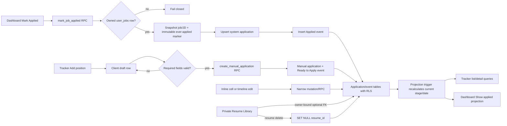

# Phase 4: Application Tracker - Research

**Researched:** 2026-07-27  
**Domain:** React spreadsheet-style editing over a Supabase/PostgreSQL application and event ledger  
**Confidence:** HIGH

<user_constraints>
## User Constraints (from CONTEXT.md)

### Locked Decisions

### Dashboard-to-tracker flow

- **D-01:** A system-discovered job enters the tracker when the user selects **Mark Applied** on the Dashboard. That action creates or updates the tracker entry at Applied.
- **D-02:** Do not add **Save to tracker** or create tracker entries merely because an employer Apply link was opened.
- **D-03:** Manually entered positions exist in the Tracker only. They do not appear in or receive ranking from the Dashboard.
- **D-04:** Dashboard **Show applied** contains every system job that was ever marked applied, even after its tracker stage changes. It displays the current tracker stage and the job never returns to the active Dashboard queue.

### Tracker table and stages

- **D-05:** Use exactly six tracker stages: **Ready to Apply**, **Applied**, **Outreach Sent**, **Interview**, **Offer**, and **Rejected**. **Saved** is renamed **Ready to Apply**, and **Resume Prepared** is removed.
- **D-06:** Stage treatments are: Ready to Apply neutral, Applied blue, Outreach Sent cyan, Interview light green, Offer green, and Rejected red.
- **D-07:** Present applications in one spreadsheet-like table with stage filters, not a Kanban board or separate tables. Each row uses a colored stage badge and a subtle matching accent.
- **D-08:** Use hybrid Excel-style editing. Stage, relevant date, and notes edit inline. Company and title are read-only for system-discovered jobs but remain editable for manual jobs.
- **D-09:** Default visibility includes active stages only: Ready to Apply, Applied, Outreach Sent, and Interview. Offer and Rejected remain accessible through filters.
- **D-10:** Users can star or pin applications. Pinned rows sort first; unpinned rows sort by most recently updated.
- **D-11:** Autosave each edited cell and show an explicit **Saving**, **Saved**, or **Retry** state.

### Stage history and dates

- **D-12:** Keep the main table compact. Expanding a row reveals a full-width horizontal timeline with dates above circular nodes and stage/event labels below, following the supplied visual reference.
- **D-13:** The timeline is chronological event history rather than a fixed one-node-per-stage diagram. Repeated events create additional nodes, including Interview 1, Interview 2, and later rounds.
- **D-14:** Every stage update automatically records the current date without prompting.
- **D-15:** Users can edit or delete timeline events to correct mistakes. The application’s current stage recalculates from the most recent remaining event.

### Manual job capture

- **D-16:** **Add position** inserts a new editable row directly into the table.
- **D-17:** A manual position requires company, job title, and job URL. Location, job description, notes, and other details are optional.
- **D-18:** New manual rows default to Ready to Apply, with the stage dropdown immediately editable.
- **D-19:** A likely duplicate company/title combination produces a warning but does not block creation.

### Notes and resume links

- **D-20:** Each application has one freeform notes field. The table shows an inline preview and the expanded row shows the full text.
- **D-21:** An application may optionally reference an existing item in the user’s private Resume Library. The app does not generate or tailor that resume.
- **D-22:** Show the linked resume in the expanded row and use a small resume icon in the main row as an indicator; do not add a dedicated Resume column.
- **D-23:** If a linked resume is deleted, retain the application and automatically clear the resume reference.

### the agent's Discretion

- Exact database schema, migration structure, and API boundaries, provided system and manual applications share one tracker lifecycle.
- Exact table column order, responsive behavior, timeline connector styling, and neutral Ready to Apply palette within the locked spreadsheet and color decisions.
- Empty, loading, validation, and recoverable error-state wording consistent with established application patterns.

### Deferred Ideas (OUT OF SCOPE)

None. Automated resume tailoring was intentionally removed from the product rather than deferred as part of this phase.
</user_constraints>

<phase_requirements>
## Phase Requirements

| ID | Description | Research Support |
|----|-------------|------------------|
| TRAK-01 | User can track each application through exactly six stages: Ready to Apply, Applied, Outreach Sent, Interview, Offer, and Rejected | Implement the six-stage lifecycle in D-05 as an event ledger plus a database-maintained current-stage projection. [VERIFIED: `04-CONTEXT.md` D-05 and `.planning/REQUIREMENTS.md`] |
| TRAK-02 | User can manually add a job to the tracker (jobs found outside the system) | Use a client-side draft table row followed by one atomic manual-create RPC after company, title, and HTTPS URL are valid. [VERIFIED: `04-CONTEXT.md` D-16–D-19; RECOMMENDED design] |
| TRAK-03 | User can attach notes to each tracked application | Store one bounded `notes` field on the application row and autosave only that column. [VERIFIED: `04-CONTEXT.md` D-20; RECOMMENDED design] |
| TRAK-04 | Tracked application links its preserved JD context and, when available, a resume the user prepared manually outside the app | Snapshot system JD/title/company/location/URL at Mark Applied time, store manual JD as plain text, and use an ownership-safe optional resume foreign key that clears only `resume_id` on resume deletion. [VERIFIED: existing `jobs`/`resumes` schema; CITED: https://www.postgresql.org/docs/current/ddl-constraints.html] |
</phase_requirements>

## Summary

Phase 4 should add a durable `applications` aggregate and an `application_stage_events` ledger rather than stretching `user_jobs.applied_at` into a second lifecycle. The current Dashboard implementation treats `applied_at` as reversible, filters Applied through a live open `jobs` join, and exposes an Undo action. Those three behaviors cannot satisfy D-04, because a later tracker stage, closed/deleted source job, or undo could remove a job from Show applied or return it to Active. [VERIFIED: `web/src/lib/feed.ts`, `web/src/pages/Dashboard.tsx`, migrations 0037–0038, and `04-CONTEXT.md` D-04]

Mark Applied must become one idempotent database transaction: authorize the owned `user_jobs` row, capture immutable source-job display/JD fields, upsert the system application, insert its Applied event, and retain an immutable “ever applied” marker. Existing rows with non-null `user_jobs.applied_at` must be backfilled into the new aggregate and event ledger in the forward migration. Dashboard Active should exclude any system application; Dashboard Show applied should read the tracker-backed system-application projection and display `current_stage`. [VERIFIED: current schema and Dashboard query behavior; RECOMMENDED architecture]

Stage/event mutations must be database-atomic. A trigger or shared projection function should recalculate `applications.current_stage` and `current_stage_date` from the latest remaining event after insert, edit, or delete. The React layer should retain local cell drafts, serialize writes per `applicationId:field`, expose Saving/Saved/Retry, and invalidate only the tracker/Dashboard keys affected by a successful mutation. TanStack Query mutations otherwise run in parallel and may resolve out of order. [CITED: https://tanstack.com/query/latest/docs/framework/react/guides/mutations]

**Primary recommendation:** Build one RLS-protected application aggregate plus chronological event ledger in forward migration 0051, make Dashboard Mark Applied and the legacy backfill atomic, and implement the table as local-draft cells over narrow Supabase RPC/update functions with tracker-backed Dashboard Applied rendering. [VERIFIED: repository migration head 0050 and existing client architecture; RECOMMENDED design]

## Architectural Responsibility Map

| Capability | Primary Tier | Secondary Tier | Rationale |
|------------|-------------|----------------|-----------|
| Durable application snapshots and origin | Database / Storage | API / Backend | The database must retain system context independently of mutable or deleted `jobs`/`user_jobs` rows. [VERIFIED: current FK cascade and D-04; RECOMMENDED design] |
| Current stage and chronological event history | Database / Storage | Browser / Client | PostgreSQL owns the event ledger and derived projection; React renders and edits it. [VERIFIED: D-12–D-15; RECOMMENDED design] |
| Mark Applied integration | Database / Storage | Browser / Client | One transaction must update the Dashboard queue and tracker without partial state. [VERIFIED: current two-state risk; RECOMMENDED design] |
| Spreadsheet editing and status feedback | Browser / Client | Database / Storage | React owns cell drafts and Saving/Saved/Retry; narrow database operations own durable validation. [CITED: https://tanstack.com/query/v5/docs/framework/react/guides/optimistic-updates] |
| Manual position capture | Browser / Client | Database / Storage | A visual draft row can be incomplete, but the persisted row must satisfy required-field constraints. [VERIFIED: D-16–D-18; RECOMMENDED design] |
| Resume association and delete behavior | Database / Storage | Browser / Client | A composite owner-bound foreign key prevents cross-user linkage and clears the optional reference on delete. [CITED: https://www.postgresql.org/docs/current/ddl-constraints.html] |
| Preserved JD rendering | Browser / Client | Database / Storage | The database stores the snapshot; React renders system HTML only after DOMPurify and manual descriptions as text. [VERIFIED: `JobDetail.tsx`; CITED: https://cornucopia.owasp.org/taxonomy/asvs-5.0/01-encoding-and-sanitization/03-sanitization] |
| Tracker filters, pin ordering, and paging | Database / Storage | Browser / Client | Filter and stable `(pinned, updated_at, id)` ordering should occur before the page limit; React controls selected stages. [VERIFIED: Dashboard RPC precedent; RECOMMENDED design] |

## Project Constraints (from project instructions)

- Keep the Cloudflare Pages React SPA and Supabase/PostgreSQL backend; do not add an SSR or separate application server. [VERIFIED: `.claude/CLAUDE.md`, `.planning/PROJECT.md`, and current code]
- Preserve strict per-user separation; route guards are UX only and database authorization is mandatory. [VERIFIED: `.planning/PROJECT.md` key decisions and existing RLS migrations]
- Keep resumes private and user-deletable; deleting a resume must not delete the application. [VERIFIED: project security constraint and D-23]
- Do not add automated resume tailoring, application submission, LinkedIn automation, manual-job ranking, alerts, or outreach generation. [VERIFIED: `.planning/PROJECT.md` and `04-CONTEXT.md`]
- Use a forward-only migration; historical deployed migrations 0001–0050 are immutable. [VERIFIED: repository migration chain and established release practice]
- Production database pushes and hosted mutations require an explicit execution-plan approval boundary; this research performs none. [VERIFIED: existing rollout plans and project workflow]
- No project-defined skills exist under `.claude/skills`, `.codex/skills`, or `.agents/skills`. [VERIFIED: project skill discovery]

## Standard Stack

### Core

| Library / Service | Project Version | Purpose | Why Standard |
|-------------------|-----------------|---------|--------------|
| PostgreSQL via Supabase | major 17; local image metadata 17.6.1.147 | Applications, events, constraints, triggers, RLS, atomic RPCs | Already the sole durable backend and authorization boundary. PostgreSQL 17 supports the composite FK and column-list `ON DELETE SET NULL` design used here. [VERIFIED: `supabase/config.toml` and `.temp/postgres-version`; CITED: https://www.postgresql.org/docs/current/ddl-constraints.html] |
| `@supabase/supabase-js` | pinned 2.110.7; registry 2.110.9 on 2026-07-27 | Browser reads, narrow updates, and RPC calls | Reuse the existing client and error conventions; do not upgrade during Phase 4 unless separately justified. [VERIFIED: `web/package.json` and npm registry; CITED: https://supabase.com/docs/reference/javascript/rpc] |
| React | pinned 19.2.7; registry 19.2.8 on 2026-07-27 | Spreadsheet table, draft cells, expanded rows, timeline | Already owns every page and route. [VERIFIED: `web/package.json` and npm registry] |
| `@tanstack/react-query` | pinned 5.101.2; registry 5.101.4 on 2026-07-21 | Tracker queries, mutation status, rollback/invalidation, serialized cell writes | Existing application pattern; v5 mutation scopes serialize same-scope mutations. [VERIFIED: `web/package.json` and npm registry; CITED: https://tanstack.com/query/latest/docs/framework/react/guides/mutations] |

### Supporting

| Library | Project Version | Purpose | When to Use |
|---------|-----------------|---------|-------------|
| DOMPurify | 3.4.12 | Sanitize preserved system JD HTML before rendering | Only in the expanded system-application description; manual JD stays plain text. [VERIFIED: `web/package.json` and `JobDetail.tsx`; CITED: https://cornucopia.owasp.org/taxonomy/asvs-5.0/01-encoding-and-sanitization/03-sanitization] |
| React Router | 8.2.0 | Existing `/tracker`, Dashboard, and detail navigation | Reuse the current placeholder route; no route package change. [VERIFIED: `web/package.json` and `main.tsx`] |
| Tailwind CSS | 4.3.3 | Stage badges, row accents, horizontal overflow, responsive controls | Reuse existing utility conventions and dark-mode treatments. [VERIFIED: `web/package.json` and current pages] |
| Vitest | pinned 4.1.10; registry 4.1.10 on 2026-07-24 | Client, page, raw migration, and verifier tests | The focused Phase 4 dependency baseline currently passes 62 tests in 276 ms. [VERIFIED: local test run 2026-07-27] |

### Alternatives Considered

| Instead of | Could Use | Tradeoff |
|------------|-----------|----------|
| Parent application + event ledger | One row with a JSON history array | JSON makes per-event edit/delete, chronological indexing, RLS, and atomic current-stage recalculation harder. Use normalized events. [RECOMMENDED design] |
| Database projection trigger/shared function | Browser-computed current stage | Browser derivation can disagree across Dashboard and Tracker and can be bypassed. Keep the database authoritative. [RECOMMENDED design] |
| Local draft overlay plus React Query mutations | A spreadsheet/grid package | The locked UI needs compact editing, filters, and one timeline expansion—not a full formula/grid engine. No new dependency is warranted. [VERIFIED: D-07–D-15; RECOMMENDED design] |
| Tracker-backed Dashboard Applied query | Continue the existing `dashboard_feed_page('applied')` join | The existing query requires a live open job and therefore cannot retain every ever-applied system job. [VERIFIED: migration 0038] |

**Installation:** No new package installation is required. Keep the existing lockfile unchanged. [VERIFIED: required capabilities are present in `web/package.json`]

## Package Legitimacy Audit

No external package is introduced by this phase, so the package-legitimacy gate is not applicable. Existing pinned packages remain governed by the committed lockfile. [VERIFIED: proposed stack and `web/package-lock.json`]

## Recommended Data Model

### `applications`

Use one row for both origins. Recommended columns:

| Column | Shape | Contract |
|--------|-------|----------|
| `id` | UUID PK | Stable tracker identity. [RECOMMENDED] |
| `user_id` | UUID, not null, `auth.uid()` default, auth-user cascade | RLS owner and composite-FK tenant component. [CITED: https://supabase.com/docs/guides/database/postgres/row-level-security] |
| `origin` | checked text: `system` / `manual` | Controls editable source fields and Dashboard membership. [VERIFIED: D-03 and D-08] |
| `source_job_id` | UUID, nullable only for manual, intentionally no FK | Immutable provenance/dedup key that survives deletion of the shared job. Add a partial unique index on `(user_id, source_job_id)` for system rows. [VERIFIED: D-04 and current job-cascade behavior; RECOMMENDED design] |
| `source_user_job_id` | nullable UUID FK to `user_jobs`, `ON DELETE SET NULL` | Optional live integration pointer; never the only durable provenance. [RECOMMENDED] |
| `company_name`, `job_title`, `job_url`, `location` | bounded text | Snapshot for system rows; editable fields for manual rows. Manual company/title/URL must be nonblank. [VERIFIED: D-08 and D-17] |
| `description_html`, `description_text`, `snapshot_partial` | nullable text/boolean | System rows copy the captured JD; manual rows accept plain text only. [VERIFIED: `jobs` schema and D-17/TRAK-04] |
| `notes` | bounded text, not null default empty | One freeform field with preview/full rendering. [VERIFIED: D-20] |
| `pinned` | boolean not null default false | First sort key. [VERIFIED: D-10] |
| `resume_id` | nullable UUID | Optional owner-bound resume link; see composite FK below. [VERIFIED: D-21–D-23] |
| `current_stage`, `current_stage_date` | checked text + date | Database-maintained projection of latest remaining event; never client-authored directly. [VERIFIED: D-14–D-15; RECOMMENDED design] |
| `created_at`, `updated_at` | timestamptz | `updated_at` changes for cell or event mutations and is the second sort key. [VERIFIED: D-10; RECOMMENDED design] |

Use checks for the six exact stage literals, nonblank/length-bounded manual required fields, HTTPS URL shape, and origin-specific source fields. Do not use a PostgreSQL enum because changing an enum is operationally heavier than a checked text column and the repository consistently uses checked text state columns. [VERIFIED: existing migrations; RECOMMENDED design]

### `application_stage_events`

| Column | Shape | Contract |
|--------|-------|----------|
| `id` | UUID PK | Stable edit/delete target. [RECOMMENDED] |
| `application_id`, `user_id` | UUID pair | Composite FK to `(applications.id, applications.user_id)` with `ON DELETE CASCADE`; prevents cross-owner child links. [CITED: https://www.postgresql.org/docs/current/ddl-constraints.html] |
| `stage` | checked six-stage text | Repeated values are allowed. [VERIFIED: D-05 and D-13] |
| `occurred_on` | `date`, default `current_date` | Matches the date-oriented UI and avoids local-midnight timestamp shifts. [VERIFIED: D-14; RECOMMENDED design] |
| `created_at`, `updated_at` | timestamptz | Deterministic tie-break and audit metadata. [RECOMMENDED] |

Order events by `occurred_on ASC, created_at ASC, id ASC`. Compute display ordinals per repeated stage in the client (`Interview 1`, `Interview 2`) rather than storing labels that can become stale after edits/deletes. [VERIFIED: D-13; RECOMMENDED design]

### Ownership-safe resume foreign key

Add `UNIQUE (id, user_id)` to `resumes`, then define:

```sql
-- Source: PostgreSQL foreign-key column-list SET NULL pattern
foreign key (resume_id, user_id)
  references public.resumes (id, user_id)
  on delete set null (resume_id)
```

This clears only the optional resume reference while retaining the non-null application owner. PostgreSQL supports selecting which referencing columns `SET NULL` affects, specifically for tenant/owner composite keys. Index `(resume_id, user_id)` because PostgreSQL does not automatically index referencing columns. [CITED: https://www.postgresql.org/docs/current/ddl-constraints.html]

## Architecture Patterns

### System Architecture Diagram



### Recommended Project Structure

```text
supabase/migrations/
└── 0051_application_tracker.sql       # schema, RLS, RPCs, backfill, Dashboard projection
web/src/lib/
├── tracker.ts                         # types, parsers, list/detail and mutation functions
├── tracker.test.ts                    # pure/API contract tests
└── trackerColumns.ts                  # widths/storage helpers if resizing is retained
web/src/components/
├── ApplicationTimeline.tsx            # expanded accessible event timeline
└── ApplicationTimeline.test.tsx
web/src/pages/
├── Tracker.tsx                        # table, filters, draft row, cell state
├── Tracker.test.tsx
└── Dashboard.tsx                      # tracker-backed Show applied and Mark Applied integration
web/tests/
└── migration-0051-application-tracker.test.ts
scripts/
└── verify-tracker-rls.ts              # disposable two-user cross-access and cleanup proof
```

The next migration number is 0051 as of research; the executor must re-check the migration head immediately before implementation. [VERIFIED: `supabase/migrations` on 2026-07-27]

### Pattern 1: Atomic Mark Applied and legacy backfill

`mark_job_applied(p_user_job_id)` must lock/select the invoking user's `user_jobs` row, copy current `jobs`/company/JD fields server-side, upsert on `(user_id, source_job_id)`, add an Applied event only when necessary, and set `user_jobs.applied_at = coalesce(applied_at, now())`. It must clear `dismissed_at` in the same transaction. [VERIFIED: current Mark Applied behavior; RECOMMENDED design]

Migration 0051 must backfill every pre-Phase-4 row where `user_jobs.applied_at IS NOT NULL`, including its captured job fields and one event dated from `applied_at`. This prevents release-day disappearance and makes the migration behaviorally backward compatible. [VERIFIED: existing applied state and D-04; RECOMMENDED design]

After migration:

- remove `undoJobApplied` and the Dashboard undo toast/action because D-04 says “ever marked applied” and “never returns.” [VERIFIED: D-04 and current Dashboard source]
- revoke authenticated direct UPDATE of `user_jobs.applied_at`; only the atomic RPC may set it. Keep it as historical compatibility data, not current stage. [RECOMMENDED]
- Active Dashboard selection must exclude any matching system application, not infer tracker membership from current stage. [VERIFIED: D-04; RECOMMENDED]
- Show applied must query system applications independent of source job status and display current tracker stage. [VERIFIED: D-04; RECOMMENDED]

### Pattern 2: Database-maintained stage projection

Create one projection function used by an `AFTER INSERT OR UPDATE OR DELETE` event trigger. For the affected application, select the latest event by `occurred_on DESC, created_at DESC, id DESC`, update `current_stage/current_stage_date/updated_at`, and return. The trigger must handle `OLD.application_id` on delete and `NEW.application_id` otherwise. [RECOMMENDED]

Reject deleting the final remaining event with a recoverable database error; otherwise the non-null current-stage invariant has no source event. The UI should explain that the final event can be edited instead. This is an implementation rule within schema/API discretion, not a seventh stage. [RECOMMENDED]

Timeline edits can change stage or date. If an edited event moves earlier than another event, the projection must naturally switch to the newly latest remaining event. [VERIFIED: D-15; RECOMMENDED]

### Pattern 3: Client-only draft row for manual creation

`Add position` should immediately prepend a visual row with temporary client ID and editable cells, but it should not persist a half-valid database row. Persist once company, title, and safe HTTPS URL are present; then replace the temporary ID with the RPC result. [VERIFIED: D-16–D-18; RECOMMENDED]

The create RPC should return `duplicate_warning` based on normalized same-user company/title (`btrim`, whitespace collapse, lowercase), but always create the row. This avoids a check-then-insert race while honoring the nonblocking warning. [VERIFIED: D-19; RECOMMENDED]

### Pattern 4: Per-cell autosave state

Use a cell-local draft over server data:

1. Stage and pin save immediately; text/date cells save on blur or explicit keyboard commit. [RECOMMENDED]
2. Key state by `applicationId:field` and expose `Saving`, `Saved`, or `Retry` beside/in the edited cell. [VERIFIED: D-11]
3. Serialize writes for the same cell. TanStack mutations otherwise execute concurrently and can resolve out of call order; a stable mutation `scope.id` serializes them. [CITED: https://tanstack.com/query/latest/docs/framework/react/guides/mutations]
4. Keep a failed draft visible and retry the same payload; mutations do not retry automatically by default. [CITED: https://tanstack.com/query/latest/docs/framework/react/guides/mutations]
5. On success, patch or invalidate `['tracker-applications', filters]`, the expanded detail key, and `['dashboard-applied-applications']` only when stage/source display fields changed. [CITED: https://tanstack.com/query/v5/docs/framework/react/guides/invalidations-from-mutations]

Do not use a single page-wide “saving” boolean; concurrent cell saves would hide which value failed. [RECOMMENDED]

### Pattern 5: Lazy expanded detail

Keep list rows bounded to table fields, notes, resume indicator, and current stage/date. Fetch JD snapshot, resume label, and ordered events only when a row expands, keyed by application ID. This mirrors the existing feed rule that untrusted JD bodies are fetched only in detail contexts. [VERIFIED: `feed.ts`/`JobDetail.tsx`; RECOMMENDED]

Render the expanded timeline as a second `<tr>` with one `<td colSpan={...}>`, horizontal overflow, a nonwrapping connector, dates above nodes, and labels below. Use `aria-expanded`, `aria-controls`, list semantics for events, and keyboard-accessible edit/delete buttons. [VERIFIED: visual reference and D-12; RECOMMENDED]

### RLS and function boundary

Enable RLS on both tables and add own-row policies for `authenticated` using `(select auth.uid()) = user_id`; index `user_id`. Supabase requires RLS on exposed-schema tables and recommends indexing policy columns. [CITED: https://supabase.com/docs/guides/database/postgres/row-level-security]

Recommended privilege boundary:

- `authenticated`: SELECT own rows; no direct writes to server-owned origin/source snapshot/current-stage/timestamp columns. [RECOMMENDED]
- narrow user-editable columns: notes, pinned, resume link, and manual-only company/title/URL/location/JD through explicit functions or column grants plus an immutable-system-row trigger. [RECOMMENDED]
- event mutation and application creation: named functions so validation and projection changes remain atomic. [RECOMMENDED]
- functions: prefer `SECURITY INVOKER`; if Mark Applied or creation requires `SECURITY DEFINER`, set `search_path = ''`, fully qualify every relation, explicitly check `auth.uid()`, revoke execute from `public` and `anon`, and grant only to `authenticated`. [CITED: https://supabase.com/docs/guides/database/functions]

Every cross-user negative case must be tested against both tables and every RPC because a definer function bypasses ordinary RLS evaluation. [CITED: https://supabase.com/docs/guides/database/functions; RECOMMENDED]

### Anti-Patterns to Avoid

- **Two current-stage authorities:** Do not let `user_jobs.applied_at` mean the current tracker stage; it is at most an immutable historical compatibility marker. [VERIFIED: D-04; RECOMMENDED]
- **Live-job-only tracker context:** Do not render system applications by joining only to `jobs`; retain snapshots on `applications`. [VERIFIED: D-04/TRAK-04]
- **Client-computed projection:** Do not update an event and `current_stage` in two browser requests. [RECOMMENDED]
- **Persisted incomplete manual drafts:** Do not weaken required-field constraints to make Add position feel immediate. [VERIFIED: D-16–D-18; RECOMMENDED]
- **Generic object patching:** Do not pass arbitrary client objects to `.update`; use field-discriminated payloads and database allowlists. [RECOMMENDED]
- **Stored event labels:** Do not persist “Interview 2”; derive repeated-stage ordinals after chronological sorting. [VERIFIED: D-13; RECOMMENDED]
- **Undo Applied:** Do not preserve the Phase 03.6 undo behavior; it contradicts the locked “ever applied / never returns” rule. [VERIFIED: current code and D-04]

## Runtime State Inventory

Phase 4 adds a forward data migration from the legacy Dashboard Applied state, so runtime state must be handled even though this is not a rename. [VERIFIED: current `user_jobs.applied_at` schema and D-04]

| Category | Items Found | Action Required |
|----------|-------------|-----------------|
| Stored data | `public.user_jobs.applied_at` is the existing per-user Applied record; the exact hosted non-null count was not queried during research. [VERIFIED: migrations 0037–0038] | Migration 0051 must backfill every non-null row into one system application and one Applied event before Dashboard reads switch. Prove row-count parity in hosted verification. [RECOMMENDED] |
| Live service config | Hosted Supabase has an applied migration chain through 0050; tracker tables/functions do not yet exist. No UI/database-backed external service configuration is required. [VERIFIED: migration directory/release artifacts and phase architecture] | Apply only forward migration 0051 through the approved release path; verify hosted function ACLs, table policies, and backfill parity. [RECOMMENDED] |
| OS-registered state | None identified: Phase 4 adds no launchd, systemd, Task Scheduler, PM2, service-worker, or local daemon registration. [VERIFIED: phase architecture and repository search] | None. Do not add a background worker for autosave or lifecycle projection. [RECOMMENDED] |
| Secrets/env vars | No new secret or environment-variable name is needed; the browser continues using the existing Supabase URL/publishable key and user session. [VERIFIED: proposed architecture and current `supabase.ts`] | None. Do not introduce service-role credentials into the SPA. [VERIFIED: Supabase RLS guidance] |
| Build artifacts | `web/dist` contains a pre-Phase-4 generated bundle and will not update from source edits automatically. [VERIFIED: repository inspection] | Rebuild the SPA and deploy the exact resulting artifact after tests; never hand-edit `dist`. [VERIFIED: existing Vite workflow; RECOMMENDED] |

## Don't Hand-Roll

| Problem | Don't Build | Use Instead | Why |
|---------|-------------|-------------|-----|
| Authorization | Browser ownership checks | Supabase RLS plus explicit database-function auth checks | Browser checks are bypassable; RLS is the established project boundary. [VERIFIED: project decisions; CITED: https://supabase.com/docs/guides/database/postgres/row-level-security] |
| Multi-row lifecycle transaction | Chained client writes with compensation | PostgreSQL function/transaction | Prevents tracker/feed/event partial state. [CITED: https://supabase.com/docs/guides/database/functions] |
| Current-stage state machine | React-only reducers | Event ledger plus database projection function/trigger | Keeps Dashboard and Tracker consistent after event edits/deletes. [RECOMMENDED] |
| Resume delete cleanup | UI callback that clears links | Composite FK with `ON DELETE SET NULL (resume_id)` | Works for every delete path and preserves ownership. [CITED: https://www.postgresql.org/docs/current/ddl-constraints.html] |
| HTML sanitizer | Regex stripping | Existing DOMPurify | OWASP requires a well-known sanitizer for untrusted HTML. [CITED: https://cornucopia.owasp.org/taxonomy/asvs-5.0/01-encoding-and-sanitization/03-sanitization] |
| URL parser | Scheme string checks | Browser `URL` plus existing HTTPS/credential guard and DB validation | Existing `safeApplyUrl` already rejects non-HTTPS and credentialed links. [VERIFIED: `web/src/lib/feed.ts`] |
| Mutation/cache coordinator | Custom global save queue | Existing TanStack Query mutation lifecycle/scopes | Supports pending/error variables, invalidation, rollback, and serialization. [CITED: https://tanstack.com/query/latest/docs/framework/react/guides/mutations] |
| Full spreadsheet engine | Formulas/grid virtualization | Semantic HTML table and focused cell components | The locked behavior does not require formula, selection-range, or workbook semantics. [VERIFIED: D-07–D-15; RECOMMENDED] |

**Key insight:** the deceptively hard part is not drawing a table; it is preserving one authoritative lifecycle across history edits, Dashboard queue semantics, source-row deletion, concurrent cell saves, and resume deletion. PostgreSQL constraints/functions should own those invariants. [VERIFIED: code/context synthesis; RECOMMENDED]

## Common Pitfalls

### Pitfall 1: Treating `applied_at` as the tracker stage

**What goes wrong:** Outreach, Interview, Offer, or Rejected applications disappear from Show applied or re-enter Active. [VERIFIED: D-04]  
**Why it happens:** the current Dashboard has a reversible binary Applied flag, while Phase 4 has a six-stage current state. [VERIFIED: current code and D-05]  
**How to avoid:** tracker membership is the system application row; `current_stage` is derived from events; `applied_at` is only historical compatibility. [RECOMMENDED]  
**Warning signs:** `undoJobApplied` remains callable, or Active SQL checks only `applied_at IS NULL`. [VERIFIED: current code]

### Pitfall 2: Losing preserved context when source rows change

**What goes wrong:** an old application has no title/company/JD after shared-job cleanup or source updates. [VERIFIED: current `user_jobs.job_id ON DELETE CASCADE`; RECOMMENDED risk]  
**Why it happens:** implementation stores only foreign keys. [RECOMMENDED]  
**How to avoid:** copy source fields and JD into the application transaction; keep provenance separately. [VERIFIED: TRAK-04; RECOMMENDED]  
**Warning signs:** tracker detail selects `jobs.description_*` instead of `applications.description_*`. [RECOMMENDED]

### Pitfall 3: Non-atomic event and projection writes

**What goes wrong:** timeline says Interview while table/Dashboard says Applied. [RECOMMENDED risk]  
**Why it happens:** separate requests insert/edit/delete an event and then update the parent. [RECOMMENDED]  
**How to avoid:** one database trigger/shared function recalculates after every event mutation. [RECOMMENDED]  
**Warning signs:** client code accepts a caller-supplied `current_stage`. [RECOMMENDED]

### Pitfall 4: Autosave responses arrive out of order

**What goes wrong:** an older notes value overwrites a newer edit or Saved appears while a later write is pending. [CITED: https://tanstack.com/query/latest/docs/framework/react/guides/mutations]  
**Why it happens:** mutation functions are asynchronous and parallel by default. [CITED: https://tanstack.com/query/latest/docs/framework/react/guides/mutations]  
**How to avoid:** serialize per cell, commit text on blur, and associate status with the latest submitted payload. [RECOMMENDED]  
**Warning signs:** one page-wide mutation instance handles every field without a cell key/scope. [RECOMMENDED]

### Pitfall 5: Cross-user resume linkage through a plain UUID FK

**What goes wrong:** a user may reference another user's resume ID even though RLS hides its metadata. [RECOMMENDED threat]  
**Why it happens:** a simple `resume_id REFERENCES resumes(id)` validates existence, not same-owner tenancy. [CITED: https://www.postgresql.org/docs/current/ddl-constraints.html]  
**How to avoid:** composite `(resume_id,user_id)` FK and two-user negative probes. [RECOMMENDED]  
**Warning signs:** application schema has `resume_id` but no owner-coupled FK/trigger. [RECOMMENDED]

### Pitfall 6: Incomplete manual rows become durable

**What goes wrong:** refresh leaves blank zombie rows that violate D-17. [VERIFIED: D-17; RECOMMENDED risk]  
**Why it happens:** Add position immediately inserts into the database. [RECOMMENDED]  
**How to avoid:** client-only draft until required fields are valid, then atomic create. [RECOMMENDED]  
**Warning signs:** database required fields are nullable solely to support drafting. [RECOMMENDED]

### Pitfall 7: Stored XSS or unsafe external navigation

**What goes wrong:** provider HTML or a manual URL executes script or opens a credentialed/non-HTTPS destination. [VERIFIED: existing threat handling]  
**Why it happens:** JD and URL are treated as trusted because they are stored. [RECOMMENDED]  
**How to avoid:** DOMPurify for system HTML, plain text for manual JD, `URL` parsing, HTTPS-only links, and `rel="noreferrer"`. [VERIFIED: `JobDetail.tsx`/`feed.ts`; CITED: OWASP ASVS sanitization URL above]  
**Warning signs:** manual descriptions are written to `dangerouslySetInnerHTML`, or the app renders `job_url` directly. [RECOMMENDED]

### Pitfall 8: Deleting the final event

**What goes wrong:** the application has no derivable current stage. [RECOMMENDED risk]  
**Why it happens:** D-15 allows event deletion but does not define the empty-ledger state. [VERIFIED: D-15]  
**How to avoid:** keep at least one event; reject final-event deletion and allow editing it. [RECOMMENDED]  
**Warning signs:** `current_stage` is nullable or silently defaults without a matching event. [RECOMMENDED]

### Pitfall 9: Migration omits legacy Applied rows

**What goes wrong:** pre-existing Show applied rows vanish on rollout. [RECOMMENDED risk]  
**Why it happens:** the new schema starts empty. [VERIFIED: existing `user_jobs.applied_at`]  
**How to avoid:** idempotent backfill plus migration tests with representative system rows and dates. [RECOMMENDED]  
**Warning signs:** migration creates tables but has no `INSERT ... SELECT` from `user_jobs`. [RECOMMENDED]

## Code Examples

### RLS policy and ownership index

```sql
-- Source: https://supabase.com/docs/guides/database/postgres/row-level-security
alter table public.applications enable row level security;

create index applications_user_id_idx
  on public.applications using btree (user_id);

create policy "applications_select_own"
  on public.applications
  for select
  to authenticated
  using ((select auth.uid()) = user_id);
```

### Safe database function boundary

```sql
-- Source: https://supabase.com/docs/guides/database/functions
create or replace function public.mark_job_applied(p_user_job_id uuid)
returns uuid
language plpgsql
security definer
set search_path = ''
as $$
declare
  v_user_id uuid := (select auth.uid());
begin
  if v_user_id is null then
    raise exception 'authentication_required';
  end if;

  -- Lock/select only public.user_jobs rows where user_id = v_user_id,
  -- snapshot fully qualified public.jobs/public.companies fields,
  -- upsert the application, and append the event in this transaction.
  return null; -- implementation placeholder
end;
$$;

revoke execute on function public.mark_job_applied(uuid)
  from public, anon;
grant execute on function public.mark_job_applied(uuid)
  to authenticated;
```

### Supabase RPC client

```typescript
// Source: https://supabase.com/docs/reference/javascript/rpc
export async function markJobApplied(userJobId: string): Promise<string> {
  const { data, error } = await supabase.rpc('mark_job_applied', {
    p_user_job_id: userJobId,
  })
  if (error) throw error
  if (typeof data !== 'string') throw new Error('invalid_application_id')
  return data
}
```

### Cell-local Retry pattern

```typescript
// Source: https://tanstack.com/query/v5/docs/framework/react/guides/optimistic-updates
const mutation = useMutation({
  mutationFn: saveCell,
  scope: { id: `${applicationId}:${field}` },
  retry: false,
  onSuccess: async () => {
    await queryClient.invalidateQueries({
      queryKey: ['tracker-applications'],
    })
  },
})

// Keep mutation.variables visible on error and call
// mutation.mutate(mutation.variables) from Retry.
```

## State of the Art

| Old Approach | Current Phase-4 Approach | When Changed | Impact |
|--------------|--------------------------|--------------|--------|
| Reversible `user_jobs.applied_at` Dashboard flag | Durable system application plus event ledger; `applied_at` retained only as history/compatibility | Phase 4 | Satisfies “ever marked applied,” current-stage display, and no return to Active. [VERIFIED: D-04; RECOMMENDED] |
| Applied view joined only to live open jobs | Tracker-backed system-application projection from snapshots | Phase 4 | Closed/deleted source rows no longer erase application history. [VERIFIED: current migration 0038 limitation; RECOMMENDED] |
| One timestamp per lifecycle state | Chronological editable/repeatable event rows | Phase 4 | Supports Interview 1/2 and correction without date-per-stage columns. [VERIFIED: D-12–D-15] |
| Parallel mutation calls | Per-cell serialized mutation scope with explicit Retry | TanStack Query v5 capability, adopted in Phase 4 | Prevents same-cell fulfillment reordering. [CITED: https://tanstack.com/query/latest/docs/framework/react/guides/mutations] |
| Plain optional resume FK | Composite owner-bound FK with column-list `SET NULL` | Phase 4 | Enforces same-user link and preserves application on resume deletion. [CITED: https://www.postgresql.org/docs/current/ddl-constraints.html] |

**Deprecated/outdated:**

- `undoJobApplied` and the Dashboard undo toast are incompatible with D-04 and should be removed from runtime/tests. [VERIFIED: `feed.ts`, `Dashboard.tsx`, D-04]
- Seven-stage Saved/Resume Prepared wording is superseded by D-05 and must not appear in schema, filters, badges, copy, or tests. [VERIFIED: D-05]
- The placeholder `Tracker.tsx` has no reusable behavior beyond its route. [VERIFIED: `web/src/pages/Tracker.tsx`]

## Verification Strategy

`.planning/config.json` explicitly sets `workflow.nyquist_validation` to `false`, so the formal `## Validation Architecture` section is intentionally omitted as required by the GSD research contract. The planner should still schedule the following behavior-first verification. [VERIFIED: `.planning/config.json`]

### Requirement-to-test map

| Req | Behavior | Test Layer | Fast Command / Proof |
|-----|----------|------------|----------------------|
| TRAK-01 | Six exact stages; append/edit/delete event; repeated Interview ordinal; current projection recalculation | SQL contract + lib/page unit + hosted DB integration | `npm test -- tests/migration-0051-application-tracker.test.ts src/lib/tracker.test.ts src/pages/Tracker.test.tsx` [RECOMMENDED] |
| TRAK-02 | Manual draft; required trio; Ready default; editable manual fields; nonblocking duplicate warning | lib/page unit + hosted RPC | same focused command plus disposable hosted create/cleanup [RECOMMENDED] |
| TRAK-03 | Notes preview/full edit; per-cell Saving/Saved/Retry; failed draft retained | page/lib unit | `npm test -- src/lib/tracker.test.ts src/pages/Tracker.test.tsx` [RECOMMENDED] |
| TRAK-04 | System JD snapshot survives source deletion; manual text JD; owner resume link; resume delete clears link | migration/unit + two-user hosted proof | migration test plus `verify-tracker-rls.ts` [RECOMMENDED] |
| D-01/D-04 | Mark Applied atomic/idempotent; legacy backfill; no undo/return; current stage in Show applied | feed/Dashboard/migration tests + hosted proof | `npm test -- src/lib/feed.test.ts src/pages/Dashboard.test.tsx tests/migration-0051-application-tracker.test.ts` [RECOMMENDED] |

### Required migration assertions

- transaction-wrapped forward migration 0051; no modification of migrations 0001–0050. [VERIFIED: established migration practice]
- exact six-stage constraints and absence of `saved`/`resume prepared`. [VERIFIED: D-05]
- own-row RLS, exact ACLs, indexed owner columns, function execute revokes/grants, empty search paths. [CITED: Supabase RLS/functions docs]
- composite application-event owner FK; owner-safe resume FK; resume delete sets only `resume_id` null. [CITED: PostgreSQL constraints docs]
- system source uniqueness and manual/system origin checks. [RECOMMENDED]
- backfill from every non-null legacy `applied_at`, with one Applied event and copied snapshot. [RECOMMENDED]
- Dashboard Active exclusion and tracker-backed Applied projection do not require `jobs.status = 'open'`. [VERIFIED: D-04; RECOMMENDED]
- authenticated callers cannot mutate another user's app/event or attach another user's resume. [VERIFIED: project security constraint; RECOMMENDED]

### Hosted proof

Use two independently authenticated publishable-key clients and disposable rows. Prove unfiltered and targeted cross-user reads return zero; targeted updates/deletes/RPC calls fail or affect zero rows; cross-user resume attachment fails; own resume deletion nulls the application reference; event edit/delete changes current stage correctly; Mark Applied is idempotent; and cleanup leaves zero application/event/resume fixtures. [VERIFIED: existing `scripts/verify-rls.ts` pattern; RECOMMENDED]

Do not use a real user's application as a verifier fixture. Bind any production schema push, web deployment, hosted proof, and owner UAT to the exact migration/source commit and require approval in an execution plan. [VERIFIED: established release practice]

### Manual UAT focus

1. Mark a Dashboard job applied; confirm it immediately leaves Active and appears in both Tracker and Show applied at Applied. [VERIFIED: D-01/D-04]
2. Change it to Interview; confirm Show applied still contains it and shows Interview. [VERIFIED: D-04]
3. Add two Interview events, edit a date, delete a non-final event, and confirm chronological nodes/ordinals/current stage. [VERIFIED: D-12–D-15]
4. Add a manual draft, see required-field validation and duplicate warning, then save and edit company/title inline. [VERIFIED: D-16–D-19]
5. Trigger a failed autosave and confirm Retry retains the draft. [VERIFIED: D-11]
6. Link then delete a resume and confirm the application remains with no resume indicator/link. [VERIFIED: D-21–D-23]
7. Confirm system company/title are read-only, manual values are editable, terminal stages are hidden by default but filterable, and pins sort first. [VERIFIED: D-08–D-10]

## Assumptions Log

| # | Claim | Section | Risk if Wrong |
|---|-------|---------|---------------|
| A1 | The final remaining event should be editable but not deletable so every application retains a derivable current stage. [ASSUMED] | Architecture Pattern 2 / Pitfall 8 | If product instead permits an empty history, schema and UI need a defined null/default current stage. |
| A2 | “Relevant date” in the main table is the date of the latest chronological event and uses a date rather than a timestamp. [ASSUMED] | Recommended Data Model | If exact times are required, the schema and timezone/display tests must use `timestamptz`. |
| A3 | Dashboard Show applied may use a tracker-backed compact row shape rather than preserving every score/ranking column from the Active feed. [ASSUMED] | Pattern 1 | If score columns must remain, snapshot or separately retain their display values without reintroducing a live-job dependency. |

## Open Questions (RESOLVED)

1. **Can the final event be deleted?**
   - What we know: event deletion is required, and current stage must recalculate from the latest remaining event. [VERIFIED: D-15]
   - **RESOLVED:** Reject deletion of the final event and offer Edit instead. The approved UI contract requires every application to retain one timeline event and supplies the exact guard copy. [VERIFIED: `04-UI-SPEC.md` § “Event Deletion” and § “Copywriting Contract”]

2. **Does the main date need time-of-day?**
   - What we know: every stage update records the current date, and the visual reference shows dates. [VERIFIED: D-12/D-14]
   - **RESOLVED:** Persist and edit stage dates as date-only `occurred_on`; retain `created_at timestamptz` only for deterministic same-day ordering and audit metadata. [VERIFIED: `04-UI-SPEC.md` § “Entry and Keyboard Behavior” and § “Horizontal Event Timeline”]

3. **Which Dashboard columns remain in Show applied?**
   - What we know: every system application and current tracker stage are mandatory; current implementation renders the Active feed columns. [VERIFIED: D-04 and current Dashboard]
   - **RESOLVED:** Render exactly seven tracker-backed snapshot columns in this order: Position, Company, Location, Applied date, Current stage, Apply link, and Tracker link. Score, tier, and best-fit-resume columns are excluded. [VERIFIED: `04-UI-SPEC.md` § “Show Applied”]

## Environment Availability

| Dependency | Required By | Available | Version | Fallback |
|------------|-------------|-----------|---------|----------|
| Node.js | web tests/build | ✓ | 26.3.1 | — [VERIFIED: local probe] |
| npm | dependency scripts | ✓ | 11.16.0 | — [VERIFIED: local probe] |
| Supabase CLI package | migration reset/push | ✓ with sandbox caveat | pinned 2.109.1 | Run through an approved environment with writable CLI telemetry/config state. [VERIFIED: `web/node_modules/supabase/package.json` and local probe] |
| PostgreSQL local target | schema semantics | configured | major 17; image metadata 17.6.1.147 | Hosted Supabase proof after approved push. [VERIFIED: `supabase/config.toml` and `.temp/postgres-version`] |
| Docker client | local Supabase | ✓ client; ✗ daemon response | 29.6.2 client | Raw migration contract tests first; start Docker Desktop before `supabase db reset`, or use approved hosted proof. [VERIFIED: local probe] |
| `psql` | optional direct SQL inspection | ✗ | — | Supabase CLI / Data API. [VERIFIED: local probe] |
| Deno | Edge functions | ✗, not required | — | No Edge Function is needed for this browser/database phase. [VERIFIED: phase architecture] |
| Wrangler | Cloudflare CLI deploy | ✗, not required locally | — | Existing Git/Cloudflare deployment workflow. [VERIFIED: local probe and project architecture] |

**Missing dependencies with no fallback:** None for implementation and fast tests. A live local database test requires a running Docker daemon or an approved hosted database. [VERIFIED: environment audit]

**Missing dependencies with fallback:** Docker daemon, `psql`, Deno, and Wrangler have the fallbacks shown above. [VERIFIED: environment audit]

## Security Domain

### Applicable ASVS Categories

| ASVS Category | Applies | Standard Control |
|---------------|---------|-----------------|
| V2 Authentication | yes | Existing Supabase Auth and `authenticated` database role; no new auth flow. [VERIFIED: current app] |
| V3 Session Management | yes | Existing `AuthProvider`/`RequireAuth`; database still rejects absent `auth.uid()`. [VERIFIED: current app; CITED: Supabase RLS docs] |
| V4 Access Control | yes | Own-row RLS, indexed `user_id`, explicit RPC ownership checks, composite owner FKs, two-user negative probes. [CITED: https://supabase.com/docs/guides/database/postgres/row-level-security] |
| V5 Input Validation | yes | Six-stage allowlist, origin/required-field/length checks, UUID targets, HTTPS URL guard, plain-text manual JD, sanitized system HTML. [CITED: OWASP ASVS sanitization URL] |
| V6 Cryptography | no new control | Continue Supabase-managed transport/storage protections; do not add custom cryptography. [VERIFIED: project architecture] |

### Known Threat Patterns for React + Supabase Tracker

| Pattern | STRIDE | Standard Mitigation |
|---------|--------|---------------------|
| Cross-user application/event access by guessed UUID | Information Disclosure / Elevation | RLS `user_id = auth.uid()`, target filters, and two-account negative probes. [CITED: Supabase RLS docs] |
| Cross-user resume attachment | Elevation | Composite `(resume_id,user_id)` FK plus RPC ownership checks. [CITED: PostgreSQL constraints docs] |
| Forged system snapshot or origin | Tampering | Server-side Mark Applied snapshot, origin-specific checks, immutable system fields. [RECOMMENDED] |
| Event/current-stage disagreement | Tampering | Atomic database projection trigger and no direct current-stage grant. [RECOMMENDED] |
| Stored JD/notes XSS | Tampering / Information Disclosure | React text rendering for notes/manual JD; DOMPurify for system HTML; never interpolate raw HTML. [CITED: OWASP ASVS sanitization URL] |
| `javascript:`, `data:`, credentialed, or insecure job URL | Spoofing | `URL` parser, HTTPS-only protocol, no credentials, `rel="noreferrer"`, database check. [VERIFIED: existing `safeApplyUrl`; RECOMMENDED] |
| Definer RPC bypasses RLS | Elevation | Empty search path, full qualification, explicit `auth.uid()`, exact execute ACL, cross-user RPC tests. [CITED: Supabase functions docs] |
| Autosave lost update | Tampering | Field-specific patches and serialized same-cell mutations; no whole-row stale writes. [CITED: TanStack mutation docs] |
| Oversized notes/JD payload | Denial of Service | Database and client length bounds; do not fetch JD in list rows. [RECOMMENDED] |

## Sources

### Primary (HIGH confidence)

- Repository code and migrations: `web/src/lib/feed.ts`, `web/src/pages/Dashboard.tsx`, `web/src/pages/JobDetail.tsx`, `web/src/lib/resumes.ts`, migrations 0002/0006/0019/0037/0038, and migration head 0050 — current integration, FK, RLS, and lifecycle facts. [VERIFIED: codebase inspection]
- `.planning/phases/04-application-tracker/04-CONTEXT.md` — locked product and UI decisions. [VERIFIED: project context]
- `.planning/REQUIREMENTS.md`, `.planning/ROADMAP.md`, `.planning/PROJECT.md`, `.planning/config.json` — requirement mapping, superseded wording, constraints, and Nyquist setting. [VERIFIED: project documents]
- Local focused Vitest run — 62/62 relevant existing tests passed on 2026-07-27. [VERIFIED: local execution]

### Secondary (MEDIUM confidence)

- https://supabase.com/docs/guides/database/postgres/row-level-security — RLS, `auth.uid()`, indexes, query filters, and role policies. [CITED: official documentation]
- https://supabase.com/docs/guides/database/functions — invoker/definer, empty search path, and execute privileges. [CITED: official documentation]
- https://supabase.com/docs/reference/javascript/rpc — JavaScript RPC calls. [CITED: official documentation]
- https://supabase.com/docs/reference/javascript/update — filtered partial updates. [CITED: official documentation]
- https://www.postgresql.org/docs/current/ddl-constraints.html — composite FKs, `ON DELETE SET NULL` column lists, and referencing indexes. [CITED: official documentation]
- https://tanstack.com/query/latest/docs/framework/react/guides/mutations — mutation ordering, retries, and scopes. [CITED: official documentation]
- https://tanstack.com/query/v5/docs/framework/react/guides/optimistic-updates — pending/error variables, rollback, and invalidation. [CITED: official documentation]
- https://tanstack.com/query/v5/docs/framework/react/guides/invalidations-from-mutations — targeted post-mutation invalidation. [CITED: official documentation]
- https://cornucopia.owasp.org/taxonomy/asvs-5.0/01-encoding-and-sanitization/03-sanitization — well-known HTML sanitization requirement. [CITED: official OWASP taxonomy]
- npm registry checks on 2026-07-27 — current release metadata for existing packages; no upgrade is recommended. [VERIFIED: npm registry read-only queries]

### Tertiary (LOW confidence)

- None. The three prior product interpretations are resolved by the approved `04-UI-SPEC.md`. [VERIFIED: research review and `04-UI-SPEC.md`]

## Metadata

**Confidence breakdown:**

- Standard stack: HIGH — no new dependency; exact project pins and current registry metadata were inspected. [VERIFIED: package/registry inspection]
- Architecture: HIGH — the recommendations follow locked behavior and concrete existing Dashboard, RLS, resume, query, and migration seams. [VERIFIED: code/context inspection]
- Database semantics: MEDIUM-HIGH — official PostgreSQL/Supabase documentation supports the design; migration 0051 is not yet executed against local/hosted PostgreSQL. [CITED: official docs; VERIFIED: environment audit]
- Pitfalls: HIGH — most are direct contradictions between current reversible/live-job behavior and locked D-04/D-15/D-23 outcomes. [VERIFIED: code/context synthesis]

**Research date:** 2026-07-27  
**Valid until:** 2026-08-26, or until the migration head, Dashboard lifecycle code, or Phase 4 context changes. [ASSUMED]
