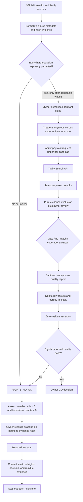

# Phase 5: Outreach Feasibility Gate - Research

**Researched:** 2026-07-28 `[VERIFIED: research session]`
**Domain:** Public-web provider rights, LinkedIn policy, disposable search-quality gating, and evidence cleanup `[VERIFIED: codebase grep of 05-CONTEXT.md]`
**Confidence:** HIGH for the current no-go; MEDIUM for legal interpretation beyond the project's fail-closed policy gate `[CITED: https://www.linkedin.com/legal/user-agreement]` `[CITED: https://www.tavily.com/terms]`

<user_constraints>
## User Constraints (from CONTEXT.md)

### Locked Decisions

### Test Applications
- **D-01:** Use eight cases: six user-selected real applications plus two
  controlled cases.
- **D-02:** The six real applications must span at least three companies,
  include both risk/finance and software/technical roles, and include no more
  than two applications from any one company.
- **D-03:** The controlled set contains one known-positive retrieval case and
  one known-negative rejection case.
- **D-04:** Real applications are copied into a disposable corpus rather than
  queried or modified in production during the spike.

### Search-Quality Gate
- **D-05:** Quality passes only when at least four of the six real applications
  yield at least one genuinely qualified LinkedIn profile, the known-positive
  control is found, and the known-negative control is rejected.
- **D-06:** A qualifying result needs supported current-company and meaningful
  role-fit evidence. Shared academic or work history improves ranking but is
  not required for a case to pass.
- **D-07:** Each application may use at most three provider searches.
- **D-08:** A provider or evidence failure gets at most one bounded retry. If it
  remains unresolved, the case is labeled `coverage_unknown` and does not count
  toward the four-of-six pass bar. It must not be mislabeled as no suitable
  profiles.

### Rights and Policy Gate
- **D-09:** A clear prohibition in either the selected provider's terms or
  LinkedIn's rules is an automatic no-go. Production search must not be built.
- **D-10:** Unclear terms are also a no-go unless written provider
  clarification resolves the ambiguity for the intended operation.
- **D-11:** The exact reviewed flow must permit public search plus display and
  persistence of the final LinkedIn URL and title-inclusive match reason.
  Reusable company-level caching is optional: omit it if it is not permitted,
  provided the hard free-tier limits remain viable without it.
- **D-12:** Rights review happens before live candidate searches in the spike.
  Both the rights/policy gate and the search-quality gate must pass for a go.
- **D-13:** A failed rights or quality gate stops the outreach milestone. Phase
  5 records the no-go and returns separate redesign choices to the owner; it
  does not automatically pivot to pasted LinkedIn URLs or non-LinkedIn pages.

### Disposable Data and Cleanup
- **D-14:** Each real-case fixture contains only an anonymous case label,
  company, job title, a few role terms, and the selected confirmed academic or
  work facts required for its searches. Do not copy tracker notes, resumes,
  linked-resume information, or full job descriptions.
- **D-15:** Raw provider responses may be retained only long enough to label
  the run and let the owner review exact results. They are deleted when the
  sanitized report is produced.
- **D-16:** The committed quality report contains anonymous case labels,
  `pass`/`no_match`/`coverage_unknown` outcomes, evidence booleans, provider
  query counts, and aggregate totals. It contains no candidate names, LinkedIn
  URLs, or source snippets.
- **D-17:** Immediately after the owner records the go/no decision, delete the
  temporary corpus and all raw results and run an automated zero-residue
  assertion. Only the sanitized report, rights evidence, and decision record
  remain.

### the agent's Discretion
- Exact query wording and allocation across role fit, manager/lead fit, and
  shared-history discovery, within the three-search cap.
- Fixture IDs, local file layout, report schema details, bounded retry timing,
  and the zero-residue assertion mechanism.
- Exact presentation of the rights matrix and quality report, provided every
  locked operation, case outcome, query count, and gate result is plainly
  reviewable by the owner.

### Deferred Ideas (OUT OF SCOPE)

- No fallback outreach capability is selected in advance. User-pasted LinkedIn
  URLs, non-LinkedIn professional pages, or stopping the feature entirely are
  separate choices to discuss only if Phase 5 records a no-go.

### Reviewed Todos (not folded)
- **Refine company visibility controls** — existing dashboard feed filtering;
  unrelated to the outreach feasibility gate.
- **Replace experience cap with title exclusions** — job-preference filtering;
  unrelated to public profile search feasibility.
- **Consolidate score tier controls** — dashboard presentation work; unrelated
  to this phase.
- **Pilot Workday polling for 10 companies** — job-source monitoring expansion;
  company-keyword overlap only and outside Phase 5.

</user_constraints>

<phase_requirements>
## Phase Requirements

| ID | Description | Research Support |
|----|-------------|------------------|
| OUTR-04 | Production implementation proceeds only after the selected public-web search provider permits the intended LinkedIn URL and match-reason display, persistence, and any caching, and the owner accepts the documented LinkedIn-policy posture; otherwise the feature remains disabled and is redesigned or stopped. | The current rights matrix reaches `NO_GO`: LinkedIn's agreement directly restricts third-party-search-derived information and deep links, and Tavily does not clearly authorize the exact persistence/outreach flow. The planner must keep production disabled, record the owner decision, and prove zero provider calls. `[CITED: https://www.linkedin.com/legal/user-agreement]` `[CITED: https://www.tavily.com/terms]` `[VERIFIED: codebase grep of .planning/phases/05-outreach-feasibility-gate/05-CONTEXT.md]` |
| OUTR-05 | Before the complete feature is built, a pre-production test across 6–10 representative applications and at least three companies demonstrates useful public LinkedIn profile URL and current-company/title evidence within the bounded free query plan, with an explicit owner go/no-go decision. | The quality test is conditional on a passing rights gate and therefore must be recorded as `NOT_RUN_RIGHTS_NO_GO`, not fabricated as pass/fail search evidence. The dormant runner contract below is implementation-ready if applicable written permissions later clear every hard operation. `[VERIFIED: codebase grep of D-01..D-13 in 05-CONTEXT.md]` |

</phase_requirements>

## Summary

The current Phase 5 outcome is **NO_GO before any live candidate search**. LinkedIn User Agreement §8.2(4) restricts copying, using, displaying, or distributing LinkedIn information obtained through third-party search tools or aggregators without the content owner's consent; §8.2(12) restricts deep-linking other than the stated exceptions without LinkedIn consent. Those clauses reach the mandatory URL-plus-title-reason flow even when the local script never visits LinkedIn. `[CITED: https://www.linkedin.com/legal/user-agreement]` LinkedIn's crawling terms and current `robots.txt` separately require express permission for automated crawling and do not establish permission for Tavily's acquisition path or this downstream use. `[CITED: https://www.linkedin.com/legal/crawling-terms]` `[CITED: https://www.linkedin.com/robots.txt]`

Tavily's current Platform Terms permit documented API access and internal Customer Application integration, but the reviewed terms do not expressly grant the exact display/persistence/cache rights required here, leave “internal business purposes” undefined for this individual job-search use, and assign responsibility for third-party terms to the customer. `[CITED: https://www.tavily.com/terms]` Its current AUP also makes third-party contractual compliance the customer's responsibility and leaves applicant-initiated networking unresolved under its restriction on facilitating unsolicited promotional communications. `[CITED: https://www.tavily.com/acceptable-use-policy]` Tavily's FAQ says zero data retention while its legal terms/privacy materials allow some retention and third-party processing, so provider-side retention for the free plan also remains unclear. `[CITED: https://docs.tavily.com/faq/faq]` `[CITED: https://www.tavily.com/privacy]`

Under D-09, either clear LinkedIn restriction is enough for automatic no-go; under D-10, each unresolved Tavily issue is independently enough for no-go; and D-12 forbids running the quality spike first. `[VERIFIED: codebase grep of D-09, D-10, and D-12 in 05-CONTEXT.md]` The planner should therefore implement only sanitized rights evidence, an exact owner no-go decision, a zero-provider-call assertion, and zero-residue proof. It must not create fixtures with real applications, call Tavily, or touch production code, schema, UI, or user data. `[VERIFIED: codebase grep of D-04, D-12, D-13, and the Phase Boundary in 05-CONTEXT.md]`

**Primary recommendation:** Close Phase 5 through its explicit no-go branch: record `RIGHTS_NO_GO`, `quality_status: NOT_RUN_RIGHTS_NO_GO`, `provider_call_count: 0`, keep production outreach disabled, and stop the milestone pending separately scoped owner choices. `[VERIFIED: codebase grep of D-09..D-13 in 05-CONTEXT.md]`

## Architectural Responsibility Map

| Capability | Primary Tier | Secondary Tier | Rationale |
|------------|-------------|----------------|-----------|
| Current rights-source capture | Local planning/evidence tooling | External official legal/docs sites | Phase 5 stores clause metadata and digests, not provider content or production state. `[VERIFIED: codebase grep of Phase Boundary and D-12 in 05-CONTEXT.md]` |
| Rights admission decision | Local deterministic evaluator | Owner checkpoint | Search eligibility is a fail-closed business-rule decision bound to exact evidence and owner acknowledgement. `[VERIFIED: codebase grep of D-09..D-12 and scripts/verify-phase-03-9-hosted.mjs]` |
| Provider search, if later authorized | Disposable local Node runner | External Tavily API | Provider access belongs behind the rights gate and outside browser, Supabase, and production application paths. `[VERIFIED: codebase grep of Phase Boundary and Existing Code Insights in 05-CONTEXT.md]` |
| Exact result review, if later authorized | Owner checkpoint over temporary local data | Disposable filesystem | Raw results exist only long enough for labeling and exact owner review. `[VERIFIED: codebase grep of D-15 in 05-CONTEXT.md]` |
| Quality classification, if later authorized | Pure local evaluator | Owner review | Deterministic evidence booleans and tri-state outcomes must remain separate from provider retrieval. `[VERIFIED: codebase grep of D-05, D-06, D-08, and scripts/verify-phase-03-9-hosted.mjs]` |
| Sanitized report and final decision | Committed planning evidence | — | Only anonymous counts, evidence booleans, rights evidence, and the decision survive. `[VERIFIED: codebase grep of D-16 and D-17 in 05-CONTEXT.md]` |
| Cleanup and residue proof | Local filesystem verifier | Git/worktree scan | Temporary corpus/raw output must be deleted and absence must be asserted, not merely claimed. `[VERIFIED: codebase grep of D-17 and scripts/verify-phase-03-9-hosted.mjs]` |
| Production browser/API/database behavior | Out of scope | — | This phase explicitly excludes production UI, schema, background collection, and application-facing search. `[VERIFIED: codebase grep of Phase Boundary in 05-CONTEXT.md]` |

## Current Rights and Policy Determination

### Operative Source Matrix

| Source | Current date marker | Exact relevance | Gate effect |
|--------|---------------------|-----------------|-------------|
| LinkedIn User Agreement | Effective 2025-11-03 | §8.2(4) covers information obtained via third-party search tools/aggregators; §8.2(12) covers deep links; §8 states exceptions require separate permission. `[CITED: https://www.linkedin.com/legal/user-agreement]` | **Prohibition absent the specified consent; automatic no-go under D-09.** `[VERIFIED: codebase grep of D-09 in 05-CONTEXT.md]` |
| LinkedIn Crawling Terms | Last revised 2017-05-25 | Automated crawling needs express permission, and permitted crawler use is limited to public search-engine indexing/display unless separately approved. `[CITED: https://www.linkedin.com/legal/crawling-terms]` | Tavily/upstream acquisition authority is not established; no-go under D-10. `[VERIFIED: codebase grep of D-10 in 05-CONTEXT.md]` |
| LinkedIn `robots.txt` | HTTP `Last-Modified` 2026-06-30 | It states automated access without express permission is prohibited and the wildcard crawler rule disallows crawling; approved search engines may be separately permitted. `[CITED: https://www.linkedin.com/robots.txt]` | Public index visibility cannot be treated as proof that Tavily or an upstream provider is authorized. |
| LinkedIn Public Profile Visibility | Page displayed a relative update marker when reviewed | Members can expose a simplified public profile to search tools, and search indexes may lag by weeks or months. `[CITED: https://www.linkedin.com/help/linkedin/answer/a520838/]` | Visibility is not an express downstream display/persistence license; it also creates freshness risk. |
| Tavily Platform Terms | Last updated 2026-05-04 | “Output” includes returned links/information; API integration is licensed for internal business purposes; third-party rights remain the customer's responsibility; reviewed text contains no express license for this exact persisted URL/reason flow. `[CITED: https://www.tavily.com/terms]` | Ambiguous for the hard operations; no-go under D-10. `[VERIFIED: codebase grep of D-10 and D-11 in 05-CONTEXT.md]` |
| Tavily Acceptable Use Policy | Last updated 2026-05-05 | It applies to Outputs, requires compliance with third-party obligations, and restricts use facilitating unsolicited promotional communications. `[CITED: https://www.tavily.com/acceptable-use-policy]` | One-to-one job-seeker outreach is not expressly classified; no-go under D-10. `[VERIFIED: codebase grep of D-10 in 05-CONTEXT.md]` |
| Tavily Privacy Policy | Last updated 2025-11-24 | Query personal information may reach third-party search-index providers, and retention/deletion can depend on account, operational, legal, or contractual needs. `[CITED: https://www.tavily.com/privacy]` | Local deletion cannot prove provider-side deletion. |
| Tavily FAQ | No revision date displayed | It states zero data retention without defining the free-plan boundary or reconciling the legal terms/privacy policy. `[CITED: https://docs.tavily.com/faq/faq]` | Retention remains ambiguous; no-go under D-10 for any flow that depends on a strict provider-side deletion claim. `[VERIFIED: codebase grep of D-10 in 05-CONTEXT.md]` |

### Operation-by-Operation Gate

| Intended operation | LinkedIn posture | Tavily posture | Determination |
|--------------------|-------------------|-----------------|---------------|
| Submit company/role queries restricted to public LinkedIn profiles | Search-tool-derived LinkedIn information falls within §8.2(4), and the provider's acquisition authority is not established. `[CITED: https://www.linkedin.com/legal/user-agreement]` `[CITED: https://www.linkedin.com/legal/crawling-terms]` | API calls are technically documented, but this user's “internal business purpose,” source authorization, and downstream rights remain unresolved. `[CITED: https://www.tavily.com/terms]` | `NO_GO` before request 1. |
| Transiently show exact results to the owner | §8.2(4) expressly reaches use/display through a third-party search tool; no reviewed source creates a short-retention exception. `[CITED: https://www.linkedin.com/legal/user-agreement]` | Human review does not itself grant rights in Output or third-party material. `[CITED: https://www.tavily.com/terms]` | `NO_GO`. |
| Persist the final canonical LinkedIn URL | Candidate-profile deep-link consent is not established under §8.2(12). `[CITED: https://www.linkedin.com/legal/user-agreement]` | No reviewed clause expressly authorizes this exact persistent downstream display. `[CITED: https://www.tavily.com/terms]` | `NO_GO`. |
| Persist a current-title-inclusive match reason | It derives from and redisplays LinkedIn-origin information received through a search tool without established content-owner consent. `[CITED: https://www.linkedin.com/legal/user-agreement]` | Technical post-processing guidance is not a rights grant. `[CITED: https://help.tavily.com/articles/8832872317-post-processing-tavily-search-results]` | `NO_GO`. |
| Reuse a company-level cache | The same information-use and deep-link restrictions continue to apply. `[CITED: https://www.linkedin.com/legal/user-agreement]` | No express cache duration/reuse authorization was found in the reviewed current terms. `[CITED: https://www.tavily.com/terms]` | Omit even if other rights later clear, unless separately approved. `[VERIFIED: codebase grep of D-11 in 05-CONTEXT.md]` |
| Delete raw local responses after review | Deletion minimizes retention but does not create permission for initial acquisition/use/display. `[CITED: https://www.linkedin.com/legal/user-agreement]` | Local deletion does not establish provider-side deletion under the current legal/privacy language. `[CITED: https://www.tavily.com/privacy]` | Required hygiene, not a cure for the failed gate. |
| Use results for manual one-to-one networking | No automated messages or LinkedIn engagement are in scope. `[VERIFIED: codebase grep of .planning/PROJECT.md and the Phase Boundary in 05-CONTEXT.md]` | The AUP's unsolicited-promotion restriction does not expressly resolve applicant-initiated networking. `[CITED: https://www.tavily.com/acceptable-use-policy]` | `NO_GO` pending written clarification. |

**Decision rule:** Owner acceptance can record the posture but cannot override D-09's automatic response to a clear prohibition or D-10's response to ambiguity. `[VERIFIED: codebase grep of D-09 and D-10 in 05-CONTEXT.md]`

## Planner Implications

### Plan the Current No-Go Path

1. Create a sanitized rights matrix containing source URL, source date marker, retrieval timestamp, clause identifier, reviewed operation, `permit|prohibit|ambiguous|not_applicable`, a short paraphrase, and a SHA-256 digest of normalized clause evidence. Store neither full policy HTML nor candidate data. `[VERIFIED: codebase grep of D-12, D-16, and D-17 in 05-CONTEXT.md]`
2. Implement a pure rights evaluator whose only current valid result is `RIGHTS_NO_GO`; assert `search_authorized === false` unless every hard operation is explicitly permitted by applicable written evidence. `[VERIFIED: codebase grep of D-09..D-12 in 05-CONTEXT.md]`
3. Produce a machine-readable decision candidate with `rights_status: NO_GO`, `quality_status: NOT_RUN_RIGHTS_NO_GO`, `provider_call_count: 0`, `fixture_count: 0`, `raw_result_count: 0`, `production_mutation_count: 0`, and the rights-evidence digest. `[VERIFIED: codebase grep of D-04, D-12, D-13, D-16, and scripts/verify-phase-03-9-hosted.mjs]`
4. Require an exact owner attestation that names the no-go, confirms production outreach remains disabled, and binds the rights-evidence digest. `[VERIFIED: codebase grep of D-13 and scripts/verify-phase-03-9-hosted.mjs]`
5. Run zero-residue verification after the decision and commit only sanitized rights evidence, decision evidence, and residue evidence. `[VERIFIED: codebase grep of D-16 and D-17 in 05-CONTEXT.md]`
6. Stop the milestone. Present deferred redesign categories separately without selecting or implementing one. `[VERIFIED: codebase grep of D-13 and Deferred Ideas in 05-CONTEXT.md]`

Use one literal decision payload, substituting only the computed digest:

```text
I ACCEPT PHASE 5 RIGHTS NO-GO <rights_evidence_sha256>; production outreach search remains disabled; the outreach milestone stops pending a separately scoped owner decision.
```

The decision verifier should reject punctuation/case drift, a missing digest, a digest that does not match the reviewed matrix, or any `GO` status paired with the current evidence. `[VERIFIED: codebase grep of D-09, D-10, D-13, and scripts/verify-phase-03-9-hosted.mjs]`

### Do Not Plan in the Current Run

- Do not create or populate the six real-application fixtures; D-12 stops before a candidate query and D-14 limits data only if a spike is authorized. `[VERIFIED: codebase grep of D-12 and D-14 in 05-CONTEXT.md]`
- Do not obtain or exercise a Tavily API key, probe the Search endpoint, or spend a provider credit. `[VERIFIED: codebase grep of D-12 in 05-CONTEXT.md]`
- Do not claim OUTR-05 search quality passed or failed; record that the rights prerequisite prevented execution. `[VERIFIED: codebase grep of D-12 and D-13 in 05-CONTEXT.md]`
- Do not add production UI, schema, edge functions, caches, background jobs, or application-facing search behavior. `[VERIFIED: codebase grep of Phase Boundary in 05-CONTEXT.md]`
- Do not pivot to pasted URLs, non-LinkedIn pages, or a different provider inside Phase 5. `[VERIFIED: codebase grep of D-13 and Deferred Ideas in 05-CONTEXT.md]`

### Reopen Condition

Reopen the dormant quality path only after applicable written evidence expressly covers: Tavily/upstream acquisition authority; transient exact-result review; display and persistence of a candidate LinkedIn URL; derivation/display/persistence of the title-inclusive reason; the exact applicant-networking purpose; and provider-side query/output retention. LinkedIn/content-owner consent required by the identified clauses must be resolved independently of any Tavily representation. `[CITED: https://www.linkedin.com/legal/user-agreement]` `[CITED: https://www.tavily.com/terms]` `[VERIFIED: codebase grep of D-10 and D-11 in 05-CONTEXT.md]`

## Standard Stack

### Core

| Library / Facility | Version | Purpose | Why Standard |
|--------------------|---------|---------|--------------|
| Node.js | 26.3.1 installed | Execute local deterministic evidence scripts. | It is already available and supplies all facilities this phase needs without package installation. `[VERIFIED: local environment probe]` |
| Native `fetch` + `AbortSignal.timeout` | Node 26 built-in | Conditional HTTPS call with a hard timeout. | Node documents browser-compatible `fetch` and abort primitives as built-ins. `[CITED: https://nodejs.org/api/globals.html#fetch]` |
| `node:fs/promises` | Node 26 built-in | Create a unique temporary run root, remove it recursively, and inspect residue. | Node documents `mkdtemp` and promise-based removal; no temp-directory dependency is needed. `[CITED: https://nodejs.org/api/fs.html#fspromisesmkdtempprefix-options]` |
| `node:crypto` | Node 26 built-in | SHA-256 evidence and approval binding. | Node documents `createHash`; the digest is evidence binding, not a digital signature. `[CITED: https://nodejs.org/api/crypto.html#cryptocreatehashalgorithm-options]` |
| `node:test` + `node:assert/strict` | Node 26 built-in | Pure evaluator, fail-closed admission, redaction, and cleanup tests. | Node's built-in test runner executes with `node --test`; the repository already uses `.test.mjs` verification scripts. `[CITED: https://nodejs.org/api/test.html]` `[VERIFIED: codebase grep of scripts/*.test.mjs]` |
| Tavily Search REST API | Current unversioned endpoint; **dormant unless rights pass** | Execute the bounded public-web quality spike. | The endpoint exposes domain filters, bounded results, usage, request IDs, and disable-able answer/raw/image fields. `[CITED: https://docs.tavily.com/documentation/api-reference/endpoint/search]` |

### Supporting

| Facility | Version | Purpose | When to Use |
|----------|---------|---------|-------------|
| Git | 2.39.3 installed | Prove only expected sanitized artifacts are committed. | Use after zero-residue checks, never to store transient fixtures or raw results. `[VERIFIED: local environment probe]` |
| ripgrep | 15.2.0 installed | Scan allowlisted workspace paths for fixture IDs and forbidden raw-result fields. | Use as a second residue check after filesystem deletion. `[VERIFIED: local environment probe]` |
| Tavily free Researcher plan | 1,000 credits/month documented | Conditional spike budget. | Use only after rights pass; no card or PAYGO. Advanced Search costs two credits, so the hard maximum of 24 physical requests costs at most 48 credits. `[CITED: https://docs.tavily.com/documentation/api-credits]` `[VERIFIED: codebase grep of D-01 and D-07 in 05-CONTEXT.md]` |

### Alternatives Considered

| Instead of | Could Use | Tradeoff |
|------------|-----------|----------|
| Native Node facilities | Third-party SDK, temp, schema, retry, or test packages | Adds supply-chain and configuration surface without solving a missing capability. Use built-ins. `[CITED: https://nodejs.org/api/globals.html#fetch]` `[CITED: https://nodejs.org/api/fs.html]` `[CITED: https://nodejs.org/api/test.html]` |
| Current no-go branch | Another provider or non-LinkedIn source | D-13 forbids an automatic pivot; redesign is a new owner-scoped decision. `[VERIFIED: codebase grep of D-13 in 05-CONTEXT.md]` |
| Conditional advanced Search | Basic Search | Advanced costs one extra credit per physical request but is the documented higher-relevance mode; even the 24-call maximum remains within the documented free allocation. `[CITED: https://docs.tavily.com/documentation/api-credits]` `[CITED: https://docs.tavily.com/documentation/api-reference/endpoint/search]` |

**Installation:**

```bash
# None. Phase 5 uses Node.js built-ins and a direct HTTPS boundary.
```

**Version verification:** No external package is recommended, so no npm package version or publish-date verification is required. Node 26.3.1 and npm 11.16.0 were confirmed locally on 2026-07-28. `[VERIFIED: local environment probe]`

## Package Legitimacy Audit

No external packages are installed in this phase, so the package-legitimacy gate is not applicable. `[VERIFIED: Standard Stack above]`

| Package | Registry | Age | Downloads | Source Repo | Verdict | Disposition |
|---------|----------|-----|-----------|-------------|---------|-------------|
| None | — | — | — | — | N/A | No installation |

**Packages removed due to [SLOP] verdict:** none `[VERIFIED: no external package recommendation]`
**Packages flagged as suspicious [SUS]:** none `[VERIFIED: no external package recommendation]`

## Architecture Patterns

### System Architecture Diagram



The current execution follows the upper `No or unclear` branch and must never reach the Tavily boundary. `[VERIFIED: codebase grep of D-09..D-13 in 05-CONTEXT.md]`

### Recommended Project Structure

```text
scripts/
└── outreach-feasibility/
    ├── rights-gate.mjs              # pure operation matrix and fail-closed verdict
    ├── rights-gate.test.mjs         # prohibition, ambiguity, stale/missing evidence tests
    ├── decision-evidence.mjs        # exact owner decision and evidence-hash binding
    ├── decision-evidence.test.mjs
    ├── residue-check.mjs            # no fixtures/raw/candidate fields/provider calls
    ├── residue-check.test.mjs
    └── dormant/                     # created only if written permissions reopen the gate
        ├── spike-runner.mjs
        ├── spike-runner.test.mjs
        ├── quality-evaluator.mjs
        ├── quality-evaluator.test.mjs
        └── sanitize-report.mjs
.planning/phases/05-outreach-feasibility-gate/
├── 05-RIGHTS-MATRIX.json            # sanitized clause/operation evidence
├── 05-DECISION.json                 # exact owner no-go, bound to evidence
└── 05-ZERO-RESIDUE.json             # machine-readable cleanup and zero-call proof
```

This layout keeps the phase inside local scripts/tests/planning evidence and leaves production functions, migrations, and web UI untouched. `[VERIFIED: codebase grep of Integration Points in 05-CONTEXT.md]`

### Pattern 1: Fail-Closed Rights Admission

**What:** Treat every mandatory operation as a separate permission claim. A single `prohibit`, `ambiguous`, missing, stale, or hash-mismatched item denies network admission. `[VERIFIED: codebase grep of D-09..D-12 in 05-CONTEXT.md]`

**When to use:** Before constructing fixtures, reading an API key, or creating a request body. `[VERIFIED: codebase grep of D-04 and D-12 in 05-CONTEXT.md]`

**Example:**

```javascript
// Source: D-09..D-12 in 05-CONTEXT.md
export function evaluateRights({ operations, evidenceSha256, approval }) {
  const hardOperations = [
    'public_search',
    'transient_owner_review',
    'persist_profile_url',
    'persist_title_reason',
    'manual_networking_purpose',
    'provider_retention',
  ]

  const permitted = hardOperations.every(
    (name) => operations[name]?.status === 'permit',
  )
  const approvalBound =
    approval?.status === 'ACCEPT_RIGHTS'
    && approval.evidence_sha256 === evidenceSha256

  return {
    status: permitted && approvalBound ? 'PASS' : 'NO_GO',
    search_authorized: permitted && approvalBound,
  }
}
```

### Pattern 2: Physical-Request Admission and Honest Tri-State Results

**What:** Count each actual HTTP attempt before the request. A retry consumes one of the three slots; after two planned queries, the third slot may be either one adaptive query or the sole bounded retry, never both. `[VERIFIED: codebase grep of D-07, D-08, and supabase/functions/discovery-sweep/index.ts]`

**When to use:** Only in the reopened quality path after rights admission returns `PASS`. `[VERIFIED: codebase grep of D-12 in 05-CONTEXT.md]`

**Classification contract:**

- `pass`: at least one result has both supported current-company evidence and meaningful role-fit evidence. `[VERIFIED: codebase grep of D-06 in 05-CONTEXT.md]`
- `no_match`: every admitted request completed and every returned candidate was evaluated, but none qualified. `[VERIFIED: codebase grep of D-06 and D-08 in 05-CONTEXT.md]`
- `coverage_unknown`: a provider, quota, timeout, malformed-response, or evidence failure remains after the one permitted retry. `[VERIFIED: codebase grep of D-08 in 05-CONTEXT.md]`

### Pattern 3: Transient Data Boundary With `finally` Cleanup

**What:** Put the minimal corpus and all raw output under a unique OS temporary root; sanitize before persistence; remove the entire run root in `finally`; then scan expected workspace locations and committed artifacts for forbidden fields. `[VERIFIED: codebase grep of D-14..D-17 in 05-CONTEXT.md]`

**When to use:** Only if the rights gate is later reopened. The current no-go path should prove that no corpus or raw directory was created at all. `[VERIFIED: codebase grep of D-12 in 05-CONTEXT.md]`

### Pattern 4: Evidence-Bound Owner Decision

**What:** Hash normalized rights evidence, sanitized quality evidence when present, and zero-residue evidence; require the exact owner decision to carry those digests. This detects evidence drift between review and approval. `[VERIFIED: codebase grep of scripts/verify-phase-03-9-hosted.mjs]`

**When to use:** At the final Phase 5 owner checkpoint for either go or no-go. `[VERIFIED: codebase grep of D-13 and D-17 in 05-CONTEXT.md]`

### Conditional Request Shape

This request is documentation only and must remain unreachable while the current gate is `NO_GO`. `[VERIFIED: codebase grep of D-12 in 05-CONTEXT.md]`

```javascript
// Source: https://docs.tavily.com/documentation/api-reference/endpoint/search
const response = await fetch('https://api.tavily.com/search', {
  method: 'POST',
  redirect: 'error',
  headers: {
    Authorization: `Bearer ${process.env.TAVILY_API_KEY}`,
    'Content-Type': 'application/json',
  },
  signal: AbortSignal.timeout(10_000),
  body: JSON.stringify({
    query,
    topic: 'general',
    search_depth: 'advanced',
    include_domains: ['linkedin.com/in'],
    max_results: 5,
    include_answer: false,
    include_raw_content: false,
    include_images: false,
    auto_parameters: false,
    include_usage: true,
  }),
})
```

Tavily documents the Search endpoint, response `request_id`/usage metadata, domain filters, and the included-field controls above; its own optimization guidance uses a LinkedIn profile-path domain filter. `[CITED: https://docs.tavily.com/documentation/api-reference/endpoint/search]` `[CITED: https://help.tavily.com/articles/7879881576-optimizing-your-query-parameters]` The implementation must validate current documentation again before a reopened run because this is an unversioned external API. `[CITED: https://docs.tavily.com/documentation/api-reference/endpoint/search]`

### Sanitized Quality Report Contract

If rights later pass, persist only:

```json
{
  "run_id": "opaque-random-id",
  "rights_evidence_sha256": "hex-digest",
  "cases": [
    {
      "case_id": "real-01",
      "kind": "real",
      "outcome": "pass",
      "current_company_supported": true,
      "meaningful_role_fit_supported": true,
      "usable_profile_found": true,
      "provider_query_count": 2,
      "retry_count": 0,
      "qualified_result_count": 1
    }
  ],
  "aggregate": {
    "real_case_pass_count": 4,
    "positive_control_found": true,
    "negative_control_rejected": true,
    "coverage_unknown_count": 0,
    "physical_provider_call_count": 16,
    "quality_gate": "PASS"
  }
}
```

The committed report must not contain names, LinkedIn URLs, snippets, raw titles, company names, job titles, role terms, queries, shared-history facts, request payloads, or full provider responses. `[VERIFIED: codebase grep of D-14..D-17 in 05-CONTEXT.md]` A recursive redaction test should reject forbidden key names and candidate-like `linkedin.com/in/` values anywhere in the object, not only at the expected schema depth. `[VERIFIED: codebase grep of D-16 and D-17 in 05-CONTEXT.md]`

### Anti-Patterns to Avoid

- **“Public” means permitted:** Public-profile visibility explains discoverability but does not override the current agreement's search-tool information and deep-link clauses. `[CITED: https://www.linkedin.com/help/linkedin/answer/a520838/]` `[CITED: https://www.linkedin.com/legal/user-agreement]`
- **No direct LinkedIn request means no LinkedIn restriction:** §8.2(4) expressly includes third-party search tools and aggregators. `[CITED: https://www.linkedin.com/legal/user-agreement]`
- **Provider terms clear source rights:** Tavily assigns third-party-rights responsibility to the customer. `[CITED: https://www.tavily.com/terms]`
- **Delete later to cure unauthorized use:** Data minimization does not supply the consent required for the initial operation. `[CITED: https://www.linkedin.com/legal/user-agreement]`
- **Generate fixtures before the rights decision:** D-12 puts the gate before live candidate search and D-04 keeps any authorized corpus disposable. `[VERIFIED: codebase grep of D-04 and D-12 in 05-CONTEXT.md]`
- **Put the API key in a fixture or decision artifact:** The key belongs only in the environment and must never enter logs, reports, hashes, or committed files. `[CITED: https://docs.tavily.com/documentation/quickstart]`
- **Let retries escape the three-call cap:** Count each physical attempt before it occurs. `[VERIFIED: codebase grep of D-07, D-08, and supabase/functions/discovery-sweep/index.ts]`
- **Treat provider error as `no_match`:** Unresolved provider/evidence failure is `coverage_unknown`. `[VERIFIED: codebase grep of D-08 and supabase/functions/_shared/discovery-health.ts]`
- **Hash approval without canonicalization:** Normalize ordering and line endings before SHA-256 so semantically identical evidence is stable and changed evidence invalidates approval. `[CITED: https://nodejs.org/api/crypto.html#cryptocreatehashalgorithm-options]`
- **Write raw responses to stdout:** Terminal capture, CI logs, and agent transcripts can outlive local cleanup; log only anonymous case ID, request count, HTTP class, and request ID. `[VERIFIED: codebase grep of D-15..D-17 in 05-CONTEXT.md]`

## Don't Hand-Roll

| Problem | Don't Build | Use Instead | Why |
|---------|-------------|-------------|-----|
| HTTPS client | Custom socket/client wrapper | Native `fetch` and `AbortSignal.timeout` | Built-in request and cancellation primitives avoid a dependency and custom timeout bugs. `[CITED: https://nodejs.org/api/globals.html#fetch]` |
| Temporary run directory | Predictable workspace folder or custom random-name loop | `fsPromises.mkdtemp(join(tmpdir(), prefix))` | Node creates a unique directory atomically. `[CITED: https://nodejs.org/api/fs.html#fspromisesmkdtempprefix-options]` |
| Recursive cleanup | Ad hoc unlink traversal | `fsPromises.rm(path, { recursive: true, force: true })` on the validated run root | Node supplies the recursive operation; validate the exact temp prefix before use. `[CITED: https://nodejs.org/api/fs.html#fspromisesrmpath-options]` |
| Evidence digest | Custom checksum | `createHash('sha256')` over canonical JSON | Standard cryptographic hashing detects drift; do not misrepresent it as signer identity. `[CITED: https://nodejs.org/api/crypto.html#cryptocreatehashalgorithm-options]` |
| Test runner | Bespoke pass/fail shell harness | `node:test` and `node:assert/strict` | Built-in test discovery and assertions fit the repository's `.test.mjs` pattern. `[CITED: https://nodejs.org/api/test.html]` `[VERIFIED: codebase grep of scripts/*.test.mjs]` |
| Retry library | Generic automatic retry middleware | Explicit one-retry state machine inside the three-physical-call budget | Generic retry can silently exceed D-07 and obscure `coverage_unknown`. `[VERIFIED: codebase grep of D-07 and D-08 in 05-CONTEXT.md]` |
| Permission inference | A custom score that converts public visibility into legal permission | Operation matrix plus applicable written clarification | D-09/D-10 demand explicit fail-closed outcomes, not probabilistic permission. `[VERIFIED: codebase grep of D-09 and D-10 in 05-CONTEXT.md]` |
| Provider SDK | Tavily SDK dependency | Direct documented REST call behind one injected function | A single disposable endpoint does not justify extra supply-chain surface. `[CITED: https://docs.tavily.com/documentation/api-reference/endpoint/search]` |

**Key insight:** The hard problem is authorization and evidence lifecycle, not HTTP transport. A cleaner search implementation cannot turn an unclear or prohibited operation into a permitted one. `[CITED: https://www.linkedin.com/legal/user-agreement]` `[CITED: https://www.tavily.com/terms]` `[VERIFIED: codebase grep of D-09 and D-10 in 05-CONTEXT.md]`

## Common Pitfalls

### Pitfall 1: Running Quality Before Rights

**What goes wrong:** A seemingly harmless “small test” sends real company/role queries and receives candidate profile data before the exact use is authorized. `[VERIFIED: codebase grep of D-12 in 05-CONTEXT.md]`
**Why it happens:** The technical request is documented while the relevant permission remains a separate gate. `[CITED: https://docs.tavily.com/documentation/api-reference/endpoint/search]` `[VERIFIED: codebase grep of D-10 and D-12 in 05-CONTEXT.md]`
**How to avoid:** Make network construction unreachable unless the rights evaluator returns exact `PASS`; test this with an injected fetch that must remain uncalled for every missing/ambiguous/prohibited input. `[VERIFIED: codebase grep of D-09..D-12 in 05-CONTEXT.md]`
**Warning signs:** An API key is read, a corpus is created, or `fetch` is invoked while any operation is not `permit`. `[VERIFIED: codebase grep of D-04 and D-12 in 05-CONTEXT.md]`

### Pitfall 2: Conflating Visibility, Acquisition, and Downstream Use

**What goes wrong:** Search-engine visibility is treated as permission to acquire, display, derive from, persist, or cache profile information. `[CITED: https://www.linkedin.com/help/linkedin/answer/a520838/]` `[CITED: https://www.linkedin.com/legal/user-agreement]`
**Why it happens:** Those are technically adjacent but contractually distinct operations. `[CITED: https://www.linkedin.com/legal/user-agreement]`
**How to avoid:** Give each operation its own matrix row and require a source clause or applicable written clarification. `[VERIFIED: codebase grep of D-10 and D-11 in 05-CONTEXT.md]`
**Warning signs:** One generic “public data permitted” cell controls the whole gate. `[VERIFIED: codebase grep of D-10 and D-11 in 05-CONTEXT.md]`

### Pitfall 3: Mistaking Provider Capability for Provider Rights

**What goes wrong:** A documented LinkedIn domain filter is read as permission for the intended job-search application. `[CITED: https://help.tavily.com/articles/7879881576-optimizing-your-query-parameters]`
**Why it happens:** API documentation shows what the system can execute, while legal terms govern what the customer may do. `[CITED: https://www.tavily.com/terms]`
**How to avoid:** Keep technical and rights evidence in separate fields; technical support never upgrades `ambiguous` to `permit`. `[VERIFIED: codebase grep of D-10 in 05-CONTEXT.md]`
**Warning signs:** A docs example is cited in the `permission_clause` field. `[CITED: https://help.tavily.com/articles/7879881576-optimizing-your-query-parameters]` `[CITED: https://www.tavily.com/terms]`

### Pitfall 4: Misreporting Unknown Coverage as No Match

**What goes wrong:** Rate limits, timeouts, malformed responses, or insufficient current-title evidence become false negatives. `[VERIFIED: codebase grep of D-08 in 05-CONTEXT.md]`
**Why it happens:** Binary pass/fail schemas have no honest operational-unknown state. `[VERIFIED: codebase grep of supabase/functions/_shared/discovery-health.ts]`
**How to avoid:** Preserve `coverage_unknown`; it never counts toward the four-of-six bar. `[VERIFIED: codebase grep of D-05 and D-08 in 05-CONTEXT.md]`
**Warning signs:** A request error increments a `no_match` total. `[VERIFIED: codebase grep of D-08 in 05-CONTEXT.md]`

### Pitfall 5: Retry and Quota Drift

**What goes wrong:** Three logical query templates plus a retry produce four physical provider requests for one case. `[VERIFIED: codebase grep of D-07 and D-08 in 05-CONTEXT.md]`
**Why it happens:** An unbounded or implicit retry is not coupled to D-07's explicit per-case provider-search cap. `[VERIFIED: codebase grep of D-07 and D-08 in 05-CONTEXT.md]`
**How to avoid:** Reserve before every outbound attempt and use the third slot for either the adaptive query or the sole retry. `[VERIFIED: codebase grep of supabase/functions/discovery-sweep/index.ts and D-07..D-08 in 05-CONTEXT.md]`
**Warning signs:** `retry_count > 0` while `provider_query_count` still reports only unique query strings. `[VERIFIED: codebase grep of D-07 and D-08 in 05-CONTEXT.md]`

### Pitfall 6: Sanitizing the Main File but Leaking Elsewhere

**What goes wrong:** Candidate URLs/snippets disappear from the report but remain in logs, exception messages, snapshots, temporary files, shell history, or Git. `[VERIFIED: codebase grep of D-15..D-17 in 05-CONTEXT.md]`
**Why it happens:** D-15 through D-17 cover raw responses, the temporary corpus, committed evidence, and post-decision residue rather than one output file. `[VERIFIED: codebase grep of D-15..D-17 in 05-CONTEXT.md]`
**How to avoid:** Keep all sensitive spike files under one unique temp root, suppress response bodies in logs/errors, remove in `finally`, scan allowlisted workspace paths, and inspect the staged diff. `[CITED: https://nodejs.org/api/fs.html#fspromisesmkdtempprefix-options]` `[VERIFIED: codebase grep of D-15..D-17 in 05-CONTEXT.md]`
**Warning signs:** `linkedin.com/in/`, `results[].content`, a real company, or a real job title appears in a committed artifact. `[VERIFIED: codebase grep of D-16 in 05-CONTEXT.md]`

### Pitfall 7: Unbound Owner Approval

**What goes wrong:** Policy evidence changes after an owner says “go,” leaving the approval attached to different evidence. `[VERIFIED: codebase grep of scripts/verify-phase-03-9-hosted.mjs]`
**Why it happens:** Free-text approval without a digest cannot prove which evidence version the owner reviewed. `[VERIFIED: codebase grep of scripts/verify-phase-03-9-hosted.mjs]`
**How to avoid:** Require an exact decision string plus rights, quality (when present), and zero-residue SHA-256 digests. `[VERIFIED: codebase grep of scripts/verify-phase-03-9-hosted.mjs]`
**Warning signs:** Evidence can be edited without invalidating approval. `[VERIFIED: codebase grep of scripts/verify-phase-03-9-hosted.mjs]`

### Pitfall 8: Treating Local Deletion as Provider-Side ZDR

**What goes wrong:** The phase claims zero provider retention because local raw files were deleted. `[CITED: https://www.tavily.com/privacy]`
**Why it happens:** Tavily's FAQ uses broad zero-retention language while its current legal/privacy material describes retention and subprocessors more broadly. `[CITED: https://docs.tavily.com/faq/faq]` `[CITED: https://www.tavily.com/privacy]`
**How to avoid:** Scope `zero_residue` to controlled local/Git surfaces and keep provider retention `ambiguous` until written clarification gives exact free-plan behavior. `[VERIFIED: codebase grep of D-10 and D-17 in 05-CONTEXT.md]`
**Warning signs:** A local filesystem assertion is presented as proof about Tavily infrastructure. `[CITED: https://www.tavily.com/privacy]`

## Code Examples

Verified patterns from official sources and established repository verification code follow. `[CITED: https://nodejs.org/api/]` `[VERIFIED: codebase grep of scripts/verify-phase-03-9-hosted.mjs]`

### Unique Temporary Root and Guaranteed Cleanup

```javascript
// Sources:
// https://nodejs.org/api/fs.html#fspromisesmkdtempprefix-options
// https://nodejs.org/api/fs.html#fspromisesrmpath-options
import { mkdtemp, rm } from 'node:fs/promises'
import { tmpdir } from 'node:os'
import { join } from 'node:path'

export async function withDisposableRun(run) {
  const root = await mkdtemp(join(tmpdir(), 'job-copilot-outreach-'))
  try {
    return await run(root)
  } finally {
    await rm(root, { recursive: true, force: true })
  }
}
```

This helper belongs only to the conditionally authorized spike; the current no-go evidence should assert it was never called. `[VERIFIED: codebase grep of D-12 in 05-CONTEXT.md]`

### Canonical Evidence Digest

```javascript
// Source: https://nodejs.org/api/crypto.html#cryptocreatehashalgorithm-options
import { createHash } from 'node:crypto'

function canonical(value) {
  if (Array.isArray(value)) return value.map(canonical)
  if (value && typeof value === 'object') {
    return Object.fromEntries(
      Object.keys(value).sort().map((key) => [key, canonical(value[key])]),
    )
  }
  return value
}

export function sha256Json(value) {
  return createHash('sha256')
    .update(`${JSON.stringify(canonical(value))}\n`, 'utf8')
    .digest('hex')
}
```

The digest proves evidence identity/drift only; it does not authenticate the owner, source, or legal meaning. `[CITED: https://nodejs.org/api/crypto.html#cryptocreatehashalgorithm-options]`

### Assert No Network Call on No-Go

```javascript
// Sources: https://nodejs.org/api/test.html and D-09..D-12 in 05-CONTEXT.md
import test from 'node:test'
import assert from 'node:assert/strict'

test('ambiguous operation prevents the first provider call', async () => {
  let calls = 0
  const fetchImpl = async () => {
    calls += 1
    throw new Error('unreachable')
  }

  const result = await runFeasibility({
    rights: { status: 'NO_GO', search_authorized: false },
    fetchImpl,
  })

  assert.equal(result.quality_status, 'NOT_RUN_RIGHTS_NO_GO')
  assert.equal(calls, 0)
})
```

### Gate the Aggregate Without Hiding Unknowns

```javascript
// Source: D-05 and D-08 in 05-CONTEXT.md
export function qualityGate(cases) {
  const real = cases.filter((item) => item.kind === 'real')
  const positive = cases.find((item) => item.kind === 'positive_control')
  const negative = cases.find((item) => item.kind === 'negative_control')

  return {
    real_case_pass_count: real.filter((item) => item.outcome === 'pass').length,
    coverage_unknown_count:
      cases.filter((item) => item.outcome === 'coverage_unknown').length,
    status:
      real.filter((item) => item.outcome === 'pass').length >= 4
      && positive?.outcome === 'pass'
      && negative?.outcome === 'no_match'
        ? 'PASS'
        : 'NO_GO',
  }
}
```

## State of the Art

| Old / Baseline Approach | Current Approach | When Changed / Verified | Impact |
|-------------------------|------------------|-------------------------|--------|
| Treat Tavily as a conditional disposable provider based on the milestone research baseline. `[VERIFIED: codebase grep of .planning/research/STACK.md]` | Re-evaluate against the Platform Terms dated 2026-05-04 and AUP dated 2026-05-05 before any call. `[CITED: https://www.tavily.com/terms]` `[CITED: https://www.tavily.com/acceptable-use-policy]` | Verified 2026-07-28. | The present terms add unresolved purpose, output-rights, third-party-rights, and retention questions; D-10 therefore blocks the spike. `[VERIFIED: codebase grep of D-10 in 05-CONTEXT.md]` |
| Rely on general public-search visibility as the policy posture. `[VERIFIED: codebase grep of .planning/research/SUMMARY.md]` | Evaluate the exact search-tool information and deep-link clauses in the User Agreement effective 2025-11-03. `[CITED: https://www.linkedin.com/legal/user-agreement]` | Verified 2026-07-28. | The mandatory URL/reason flow is not cleared merely because profiles can appear in public indexes. |
| Add fetch/testing/temp dependencies for standalone scripts. | Use stable Node built-ins for fetch, testing, hashing, and temporary files. `[CITED: https://nodejs.org/api/globals.html#fetch]` `[CITED: https://nodejs.org/api/test.html]` `[CITED: https://nodejs.org/api/fs.html]` | Node 26.3.1 verified locally 2026-07-28. `[VERIFIED: local environment probe]` | No package installation or legitimacy checkpoint is needed. |
| Treat “zero data retention” as one provider property. | Distinguish local zero residue from provider query/output retention and subprocessors. `[CITED: https://docs.tavily.com/faq/faq]` `[CITED: https://www.tavily.com/privacy]` | Verified 2026-07-28. | Local cleanup can be proven; provider-side ZDR remains unresolved without writing. |

**Deprecated/outdated:**

- **The milestone baseline alone as current policy evidence:** Tavily's legal pages now carry May 2026 dates, so Phase 5 must use the current source matrix above. `[CITED: https://www.tavily.com/terms]` `[CITED: https://www.tavily.com/acceptable-use-policy]`
- **A quality-first spike:** D-12 explicitly places rights review first. `[VERIFIED: codebase grep of D-12 in 05-CONTEXT.md]`
- **Binary `pass|no_match`:** D-08 requires `coverage_unknown` for unresolved provider/evidence failures. `[VERIFIED: codebase grep of D-08 in 05-CONTEXT.md]`

## Project Constraints

No root `AGENTS.md` exists in the working directory. `[VERIFIED: filesystem inspection]` Applicable project constraints come from `.claude/CLAUDE.md`, `.planning/PROJECT.md`, and the phase context:

| Directive | Planning Consequence |
|-----------|----------------------|
| Near-zero/free budget; no automatic paid use. `[VERIFIED: codebase grep of .claude/CLAUDE.md and .planning/PROJECT.md]` | Conditional search must use only the free Researcher allocation and must never enable PAYGO. |
| No scraping logged-in LinkedIn pages, Easy Apply automation, or auto-sent LinkedIn messages. `[VERIFIED: codebase grep of .claude/CLAUDE.md]` | The spike cannot authenticate to LinkedIn, visit profile pages automatically, or message anyone. |
| Strict per-user separation and personal-data minimization. `[VERIFIED: codebase grep of .claude/CLAUDE.md]` | Use the minimum disposable corpus, no resume/tracker copy, and no raw candidate data in committed evidence. |
| Phase 5 is evidence-only and non-production. `[VERIFIED: codebase grep of Phase Boundary in 05-CONTEXT.md]` | Do not touch Supabase migrations/functions or web UI. |
| Work must follow the GSD workflow. `[VERIFIED: codebase grep of .claude/CLAUDE.md]` | Planner and executor should use normal GSD plan/execute/verify checkpoints and commit only scoped artifacts. |

## Assumptions Log

| # | Claim | Section | Risk if Wrong |
|---|-------|---------|---------------|
| — | None. All external factual claims used for the current gate were checked against current official sources; codebase and environment claims were directly inspected. | — | — |

No assumed package, compliance rule, retention promise, or performance target is used to authorize this phase. `[VERIFIED: provenance audit of this research]`

## Operationally Resolved Questions

The questions and source facts below remain relevant if the owner later opens a
separately scoped redesign or permission review. They are not unresolved inputs
to Phase 5 planning: under D-09, D-10, and D-12, each is operationally resolved
to the current fail-closed outcome. Written clarification is a future reopen
condition only and does not authorize the current quality spike.

1. **Does LinkedIn/content-owner written consent cover this exact downstream flow?**
   - Operational resolution: `RESOLVED_FOR_PHASE_5: RIGHTS_NO_GO`.
   - What we know: Current §8.2(4) covers information obtained through search tools, and §8.2(12) covers deep links. `[CITED: https://www.linkedin.com/legal/user-agreement]`
   - What's unclear: Whether LinkedIn and each relevant content owner consent to Tavily acquisition, private exact-result review, persisted candidate-profile URL, and title-derived reason.
   - Future reopen condition: Applicable written evidence must resolve each operation before a separately scoped owner decision can reconsider the dormant path.

2. **Does Tavily authorize the exact customer, purpose, persistence, and optional reuse?**
   - Operational resolution: `RESOLVED_FOR_PHASE_5: RIGHTS_NO_GO`.
   - What we know: Tavily documents API integration but assigns third-party-rights responsibility to the customer and does not expressly resolve the required flow in the reviewed terms. `[CITED: https://www.tavily.com/terms]`
   - What's unclear: Individual job-seeker use under “internal business purposes,” one-to-one networking under the AUP, persisted URL/derived reason rights, cache duration, attribution, and post-termination behavior.
   - Future reopen condition: Obtain an answer in writing from Tavily legal/support; product documentation or technical capability is insufficient under D-10. `[VERIFIED: codebase grep of D-10 in 05-CONTEXT.md]`

3. **What is the exact free-plan retention and subprocessor behavior?**
   - Operational resolution: `RESOLVED_FOR_PHASE_5: RIGHTS_NO_GO`.
   - What we know: The FAQ's broad ZDR claim and current privacy/legal language do not produce one unambiguous free-plan rule. `[CITED: https://docs.tavily.com/faq/faq]` `[CITED: https://www.tavily.com/privacy]`
   - What's unclear: Query, output, request-log, backup, model-improvement, third-party index, and deletion timing for the Researcher plan.
   - Future reopen condition: Written clarification must define the applicable retention/deletion boundary; local zero residue must never be treated as provider-side deletion proof.

4. **If rights later clear, which exact written artifacts qualify?**
   - Operational resolution: `RESOLVED_FOR_PHASE_5: RIGHTS_NO_GO`.
   - What we know: D-10 requires written provider clarification, and LinkedIn's current clauses name consent/permission relevant to separate operations. `[VERIFIED: codebase grep of D-10 in 05-CONTEXT.md]` `[CITED: https://www.linkedin.com/legal/user-agreement]`
   - What's unclear: Whether a Tavily representation alone can establish LinkedIn/content-owner authority.
   - Future reopen condition: The writing must identify its authorization basis and exact covered operations; obtain qualified legal review if the owner wants to rely on it.

## Environment Availability

| Dependency | Required By | Available | Version | Fallback |
|------------|-------------|-----------|---------|----------|
| Node.js | Rights/decision/residue scripts | ✓ | 26.3.1 | — `[VERIFIED: local environment probe]` |
| npm | Not required; diagnostic only | ✓ | 11.16.0 | No installation needed. `[VERIFIED: local environment probe]` |
| Git | Scoped evidence commit/diff inspection | ✓ | 2.39.3 | — `[VERIFIED: local environment probe]` |
| ripgrep | Residue scanning | ✓ | 15.2.0 | Node filesystem traversal if needed. `[VERIFIED: local environment probe]` |
| Deno | Not required for this local phase | ✗ | — | Node built-ins; production edge functions are out of scope. `[VERIFIED: local environment probe and codebase grep of Phase Boundary]` |
| `TAVILY_API_KEY` | Conditional quality spike only | ✗ | — | None; do not request/configure while rights are no-go. `[VERIFIED: environment and declaration-file inspection]` |
| Tavily live Search endpoint | Conditional quality spike only | Not probed | — | Intentionally blocked by D-12. `[VERIFIED: codebase grep of D-12 in 05-CONTEXT.md]` |

**Missing dependencies with no fallback:**

- An API key and live endpoint access would block only a future authorized spike; they do not block the current rights no-go decision. `[VERIFIED: codebase grep of D-12 and D-13 in 05-CONTEXT.md]`
- Applicable written LinkedIn/content-owner permission and Tavily clarification are the substantive blockers to any candidate search. `[CITED: https://www.linkedin.com/legal/user-agreement]` `[CITED: https://www.tavily.com/terms]`

**Missing dependencies with fallback:**

- Deno is absent but unnecessary because Phase 5 is local and non-production. `[VERIFIED: local environment probe and codebase grep of Phase Boundary in 05-CONTEXT.md]`

## Security Domain

The current stable OWASP ASVS release is 5.0.0, released 2025-05-30; its category numbering differs from older ASVS 4.x templates. `[CITED: https://github.com/OWASP/ASVS/releases/tag/v5.0.0]` This phase targets the configured Level 1 baseline and strengthens data-minimization/cleanup controls because candidate search output can contain personal information. `[VERIFIED: codebase grep of .planning/config.json and D-14..D-17 in 05-CONTEXT.md]`

### Applicable ASVS 5.0 Categories

| ASVS Category | Applies | Standard Control |
|---------------|---------|-----------------|
| V1 Encoding and Sanitization | yes | Serialize controlled JSON, never interpolate raw provider text into Markdown/HTML/logs, and recursively reject forbidden keys/URLs. `[CITED: https://github.com/OWASP/ASVS]` |
| V2 Validation and Business Logic | yes | Validate rights evidence, exact statuses, physical call caps, retry caps, tri-state outcomes, and owner-digest binding. `[CITED: https://github.com/OWASP/ASVS]` `[VERIFIED: codebase grep of D-05..D-12]` |
| V4 API and Web Service | conditional | HTTPS only, fixed Tavily origin/path, timeout, response-size/result bounds, explicit status handling, and no automatic redirects to arbitrary origins. `[CITED: https://github.com/OWASP/ASVS]` |
| V5 File Handling | yes | Unique temp root, exact-prefix validation before recursive removal, no symlink following during residue scans, and cleanup in `finally`. `[CITED: https://github.com/OWASP/ASVS]` `[CITED: https://nodejs.org/api/fs.html]` |
| V6 Authentication | no | No production or user authentication changes are allowed in this phase. `[VERIFIED: codebase grep of Phase Boundary in 05-CONTEXT.md]` |
| V7 Session Management | no | No browser/session flow is added. `[VERIFIED: codebase grep of Phase Boundary in 05-CONTEXT.md]` |
| V8 Authorization | no for current no-go; conditional owner checkpoint only | The phase records exact owner approval locally and must not imply a new production authorization model. `[VERIFIED: codebase grep of scripts/verify-phase-03-9-hosted.mjs and Phase Boundary]` |
| V11 Cryptography | yes | SHA-256 binds evidence identity; secrets stay in environment; do not claim a bare digest authenticates identity. `[CITED: https://github.com/OWASP/ASVS]` `[CITED: https://nodejs.org/api/crypto.html]` |
| V13 Configuration | yes | Missing rights evidence or key fails closed; PAYGO is forbidden; production configuration is untouched. `[CITED: https://github.com/OWASP/ASVS]` `[VERIFIED: codebase grep of D-09..D-12 and PROJECT.md]` |
| V14 Data Protection | yes | Minimize fixtures, make raw data transient, sanitize committed evidence, and prove local/Git zero residue. `[CITED: https://github.com/OWASP/ASVS]` `[VERIFIED: codebase grep of D-14..D-17]` |
| V16 Security Logging and Error Handling | yes | Log anonymous IDs/counts/status classes only; never log queries, secrets, response bodies, URLs, titles, snippets, or names. `[CITED: https://github.com/OWASP/ASVS]` `[VERIFIED: codebase grep of D-15..D-17]` |

### Known Threat Patterns for the Local Node/Tavily Boundary

| Pattern | STRIDE | Standard Mitigation |
|---------|--------|---------------------|
| Rights evidence altered after review | Tampering | Canonical SHA-256 digest in the exact owner decision; invalidate approval on any digest change. `[VERIFIED: codebase grep of scripts/verify-phase-03-9-hosted.mjs]` |
| API key in logs/artifacts | Information Disclosure | Read from environment only after rights pass; redact headers; never serialize environment or request objects. `[CITED: https://docs.tavily.com/documentation/quickstart]` |
| Raw candidate output in reports/logs/Git | Information Disclosure | One temp root, counts/codes-only logs, recursive sanitizer, staged-diff scan, and zero-residue assertion. `[VERIFIED: codebase grep of D-15..D-17]` |
| Untrusted URL causes arbitrary fetch or unsafe rendered link | Spoofing / SSRF | Never fetch result URLs; if later displayed transiently, parse with `URL`, require `https:`, exact `www.linkedin.com`/`linkedin.com` host, and `/in/` path before classification. `[CITED: https://nodejs.org/api/url.html]` |
| Recursive delete targets the wrong path | Tampering / Denial of Service | Resolve and validate the unique temp-root prefix; reject empty, workspace-root, home-root, or unexpected paths before `rm`. `[CITED: https://nodejs.org/api/fs.html#fspromisesrmpath-options]` |
| Automatic retry exhausts quota | Denial of Service | Reserve every physical request, cap at three per case including retry, honor `Retry-After`, then return `coverage_unknown`. `[CITED: https://docs.tavily.com/documentation/rate-limits]` `[VERIFIED: codebase grep of D-07..D-08]` |
| Provider response manipulates logs/Markdown | Tampering / Injection | Treat every response field as untrusted data; never execute/render raw HTML or place raw text in committed Markdown. `[CITED: https://github.com/OWASP/ASVS]` |

## Sources

### Primary Project and Runtime Sources (HIGH confidence)

- `.planning/phases/05-outreach-feasibility-gate/05-CONTEXT.md` — locked gate, quality, data, cleanup, and scope decisions. `[VERIFIED: codebase grep]`
- `.planning/REQUIREMENTS.md` and `.planning/ROADMAP.md` — OUTR-04/OUTR-05 and phase success/no-go contract. `[VERIFIED: codebase grep]`
- `.planning/PROJECT.md` and `.claude/CLAUDE.md` — free-only, no LinkedIn automation, privacy, and workflow constraints. `[VERIFIED: codebase grep]`
- `supabase/functions/discovery-sweep/index.ts` — reserve immediately before each physical provider request. `[VERIFIED: codebase grep]`
- `supabase/functions/_shared/discovery-health.ts` — explicit degraded/failed state precedent. `[VERIFIED: codebase grep]`
- `scripts/verify-phase-03-9-hosted.mjs` — machine-readable checks, exact owner approval, and zero-residue precedent. `[VERIFIED: codebase grep]`
- Node.js official documentation — built-in fetch, filesystem, crypto, URL, and test APIs. `[CITED: https://nodejs.org/api/]`
- OWASP ASVS 5.0.0 official repository/release — current category structure and verification baseline. `[CITED: https://github.com/OWASP/ASVS/releases/tag/v5.0.0]`

### Primary External Policy and Provider Sources (MEDIUM confidence)

- LinkedIn User Agreement, effective 2025-11-03 — third-party-search-derived information, automated access, and deep-link clauses. `[CITED: https://www.linkedin.com/legal/user-agreement]`
- LinkedIn Crawling Terms, revised 2017-05-25 — express crawling permission and limited approved-crawler use. `[CITED: https://www.linkedin.com/legal/crawling-terms]`
- LinkedIn `robots.txt`, retrieved 2026-07-28 — current crawler notice/rules. `[CITED: https://www.linkedin.com/robots.txt]`
- LinkedIn Public Profile Visibility — public index visibility and freshness limitations. `[CITED: https://www.linkedin.com/help/linkedin/answer/a520838/]`
- LinkedIn Prohibited Software and Extensions — current help restatement of relevant User Agreement restrictions. `[CITED: https://www.linkedin.com/help/linkedin/answer/a1341387/prohibited-software-and-extensions?lang=en]`
- Tavily Platform Terms, updated 2026-05-04 — API/customer application, Output, third-party rights, and retention terms. `[CITED: https://www.tavily.com/terms]`
- Tavily AUP, updated 2026-05-05 — purpose and third-party-obligation restrictions. `[CITED: https://www.tavily.com/acceptable-use-policy]`
- Tavily Privacy Policy, updated 2025-11-24 — query sharing, retention, and deletion boundaries. `[CITED: https://www.tavily.com/privacy]`
- Tavily FAQ — broad ZDR statement requiring reconciliation with legal/privacy sources. `[CITED: https://docs.tavily.com/faq/faq]`
- Tavily Search, credits, and rate-limit documentation — conditional technical request/response and free-cap constraints. `[CITED: https://docs.tavily.com/documentation/api-reference/endpoint/search]` `[CITED: https://docs.tavily.com/documentation/api-credits]` `[CITED: https://docs.tavily.com/documentation/rate-limits]`

### Tertiary (LOW confidence)

- None used. `[VERIFIED: provenance audit of this research]`

## Metadata

**Confidence breakdown:**

- Standard stack: HIGH — local versions were probed and only current Node built-ins/official Tavily API documentation are recommended. `[VERIFIED: local environment probe]` `[CITED: https://nodejs.org/api/]`
- Architecture: HIGH — it follows locked D-09..D-17 decisions and established repository evidence patterns. `[VERIFIED: codebase grep of 05-CONTEXT.md and scripts/verify-phase-03-9-hosted.mjs]`
- Current no-go: HIGH under the project's policy — current official clauses and unresolved terms each independently trigger the locked fail-closed rules. `[CITED: https://www.linkedin.com/legal/user-agreement]` `[CITED: https://www.tavily.com/terms]` `[VERIFIED: codebase grep of D-09 and D-10]`
- External legal interpretation: MEDIUM — official sources are current, but this research is an engineering policy gate rather than legal advice. `[CITED: https://www.linkedin.com/legal/user-agreement]` `[CITED: https://www.tavily.com/terms]`
- Conditional API details: MEDIUM — official but unversioned external API documentation must be rechecked if the gate later reopens. `[CITED: https://docs.tavily.com/documentation/api-reference/endpoint/search]`
- Pitfalls and security: HIGH for code/data controls; MEDIUM where they depend on provider contractual interpretation. `[VERIFIED: codebase grep of D-14..D-17]` `[CITED: https://www.linkedin.com/legal/user-agreement]`

**Research date:** 2026-07-28 `[VERIFIED: research session]`
**Valid until:** 2026-08-04 for legal/provider posture; recheck immediately before any reopened live run. `[VERIFIED: conservative seven-day research validity window]`
